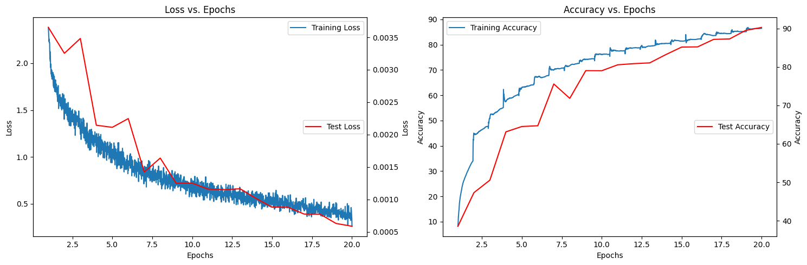
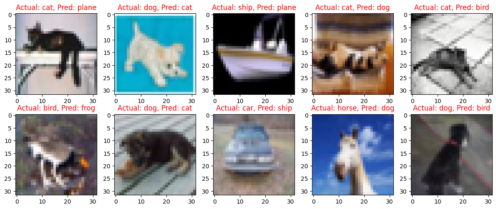
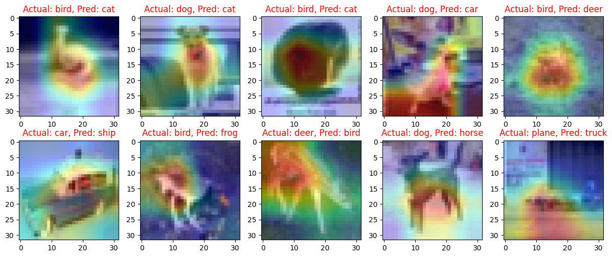

# 🌐 ERA2 Session 14 Assignment 🌐

## Problem Statement
Use the S11/13 code that was shared earlier if you don't have your own. 

1. Train any (pytorch or lightning) model on SageMaker and share the screenshot of the final logs.
2. Train any (pytorch or lightning) model on EC2 and share the screenshot of the final logs.

## Solution
This is a repository for the implementation of ResNet18 model on the CIFAR10 dataset. The implementation follows a structured approach with separate files for models, main code, and utilities.

## Main Repo and its File Structure
[Main Repo Link](https://github.com/DhrubaAdhikary/ERA_V2/tree/94580869712d7ee83fd2323334cb953d839d0436/pytorch-era2-main)  
- `models` folder: contains the implementation of ResNet18 model.
    - `main.py`: the main file that trains the ResNet18 model on the CIFAR10 dataset and performs various operations such as data split, epochs, batch size, optimizer selection, and scheduler implementation.
    - `utils.py`: contains various utilities such as image transforms, gradcam, misclassification code, tensorboard related functionality, and advanced training policies.

## Training and Results
The ResNet18 model was trained on the CIFAR10 dataset for 20 epochs. 

The **training and test loss curves** are shown in the following image:  

A gallery of **10 misclassified images** is shown below: 

The **GradCam output on 10 misclassified images** is shown below:  

## Note
- The training was performed on [insert platform here, e.g. Google Colab].  
- The implementation follows the structure specified in the TSAI - ERA2 Session 11 Assignment.  
- The transforms applied during training are RandomCrop(32, padding=4) and CutOut(16x16).  

## Screengrab of EC2 and Sagemaker connected in Remote developement mode inside VS code 

## logs 
Epoch: 0,Loss=0.20 Batch_id=97 Accuracy=93.80: 100%|██████████| 98/98 [00:36<00:00,  2.66it/s]
Test set: Average loss: 0.0007, Accuracy: 9013/10000 (90.13%)

Epoch: 1,Loss=0.24 Batch_id=97 Accuracy=92.47: 100%|██████████| 98/98 [00:37<00:00,  2.62it/s]
Test set: Average loss: 0.0007, Accuracy: 8923/10000 (89.23%)

Epoch: 2,Loss=0.25 Batch_id=97 Accuracy=91.29: 100%|██████████| 98/98 [00:37<00:00,  2.58it/s]
Test set: Average loss: 0.0007, Accuracy: 8929/10000 (89.29%)

Epoch: 3,Loss=0.28 Batch_id=97 Accuracy=90.91: 100%|██████████| 98/98 [00:38<00:00,  2.57it/s]
Test set: Average loss: 0.0010, Accuracy: 8652/10000 (86.52%)

Epoch: 4,Loss=0.27 Batch_id=97 Accuracy=90.77: 100%|██████████| 98/98 [00:38<00:00,  2.55it/s]
Test set: Average loss: 0.0010, Accuracy: 8623/10000 (86.23%)

Epoch: 5,Loss=0.30 Batch_id=97 Accuracy=91.19: 100%|██████████| 98/98 [00:38<00:00,  2.54it/s]
Test set: Average loss: 0.0009, Accuracy: 8681/10000 (86.81%)

Epoch: 6,Loss=0.27 Batch_id=97 Accuracy=91.29: 100%|██████████| 98/98 [00:39<00:00,  2.51it/s]
Test set: Average loss: 0.0008, Accuracy: 8717/10000 (87.17%)

Epoch: 7,Loss=0.26 Batch_id=97 Accuracy=91.73: 100%|██████████| 98/98 [00:39<00:00,  2.51it/s]
Test set: Average loss: 0.0008, Accuracy: 8830/10000 (88.30%)

Epoch: 8,Loss=0.21 Batch_id=97 Accuracy=92.09: 100%|██████████| 98/98 [00:39<00:00,  2.50it/s]
Test set: Average loss: 0.0011, Accuracy: 8658/10000 (86.58%)

Epoch: 9,Loss=0.21 Batch_id=97 Accuracy=92.22: 100%|██████████| 98/98 [00:39<00:00,  2.49it/s]
Test set: Average loss: 0.0007, Accuracy: 8962/10000 (89.62%)

Epoch: 10,Loss=0.25 Batch_id=97 Accuracy=92.64: 100%|██████████| 98/98 [00:39<00:00,  2.50it/s]
Test set: Average loss: 0.0009, Accuracy: 8782/10000 (87.82%)

Epoch: 11,Loss=0.19 Batch_id=97 Accuracy=92.81: 100%|██████████| 98/98 [00:39<00:00,  2.49it/s]
Test set: Average loss: 0.0008, Accuracy: 8873/10000 (88.73%)

Epoch: 12,Loss=0.23 Batch_id=97 Accuracy=93.02: 100%|██████████| 98/98 [00:39<00:00,  2.49it/s]
Test set: Average loss: 0.0006, Accuracy: 9181/10000 (91.81%)

Epoch: 13,Loss=0.19 Batch_id=97 Accuracy=93.45: 100%|██████████| 98/98 [00:39<00:00,  2.49it/s]
Test set: Average loss: 0.0006, Accuracy: 9120/10000 (91.20%)

Epoch: 14,Loss=0.31 Batch_id=97 Accuracy=93.61: 100%|██████████| 98/98 [00:39<00:00,  2.48it/s]
Test set: Average loss: 0.0007, Accuracy: 9056/10000 (90.56%)

Epoch: 15,Loss=0.19 Batch_id=97 Accuracy=93.96: 100%|██████████| 98/98 [00:39<00:00,  2.48it/s]
Test set: Average loss: 0.0007, Accuracy: 9046/10000 (90.46%)

Epoch: 16,Loss=0.15 Batch_id=97 Accuracy=94.18: 100%|██████████| 98/98 [00:39<00:00,  2.49it/s]
Test set: Average loss: 0.0007, Accuracy: 9086/10000 (90.86%)

Epoch: 17,Loss=0.26 Batch_id=97 Accuracy=94.43: 100%|██████████| 98/98 [00:39<00:00,  2.46it/s]
Test set: Average loss: 0.0006, Accuracy: 9214/10000 (92.14%)

Finished Training