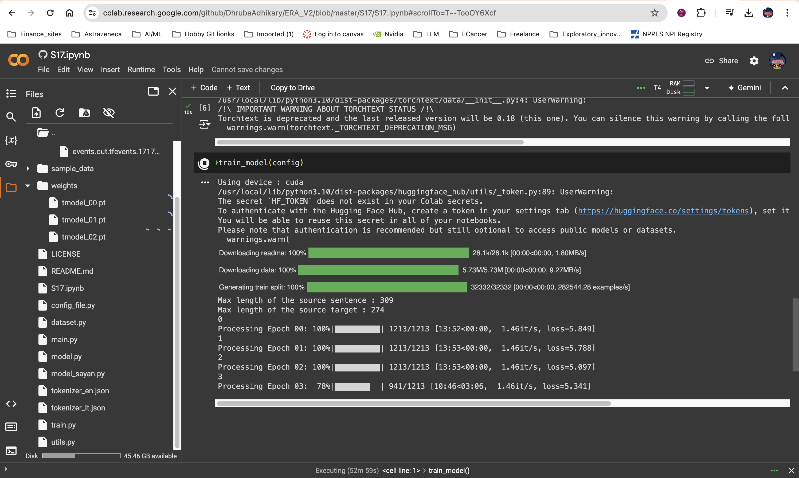

## Assignment 17

#### Link to [model.py](./model.py)
#### Link to [Jupiter Notebook](./S17.ipynb)

### Details about Training
- Used Google Colab for training
- Trained for 15 epochs
- Best Loss achieved - 2.768

### Training logs 
Max length of the source sentence : 309
Max length of the source target : 274
0
Processing Epoch 00: 100%|██████████| 1213/1213 [13:52<00:00,  1.46it/s, loss=5.849]

1
Processing Epoch 01: 100%|██████████| 1213/1213 [13:53<00:00,  1.46it/s, loss=5.788]

2
Processing Epoch 02: 100%|██████████| 1213/1213 [13:53<00:00,  1.46it/s, loss=5.097]

3
Processing Epoch 03: 100%|██████████| 1213/1213 [13:53<00:00,  1.46it/s, loss=4.712]

4
Processing Epoch 04: 100%|██████████| 1213/1213 [13:53<00:00,  1.46it/s, loss=4.474]

5
Processing Epoch 05: 100%|██████████| 1213/1213 [13:53<00:00,  1.45it/s, loss=4.259]

6
Processing Epoch 06: 100%|██████████| 1213/1213 [13:53<00:00,  1.46it/s, loss=4.274]

7
Processing Epoch 07: 100%|██████████| 1213/1213 [13:53<00:00,  1.46it/s, loss=4.392]

8
Processing Epoch 08: 100%|██████████| 1213/1213 [13:53<00:00,  1.46it/s, loss=3.823]

9
Processing Epoch 09: 100%|██████████| 1213/1213 [13:52<00:00,  1.46it/s, loss=3.367]

10
Processing Epoch 10: 100%|██████████| 1213/1213 [13:52<00:00,  1.46it/s, loss=3.568]

11
Processing Epoch 11: 100%|██████████| 1213/1213 [13:52<00:00,  1.46it/s, loss=3.357]

12
Processing Epoch 12: 100%|██████████| 1213/1213 [13:52<00:00,  1.46it/s, loss=2.846]

13
Processing Epoch 13: 100%|██████████| 1213/1213 [13:52<00:00,  1.46it/s, loss=2.680]

14
Processing Epoch 14:  90%|████████▉ | 1087/1213 [12:26<01:26,  1.45it/s, loss=2.768]

### Training SCreenshot on colab 

