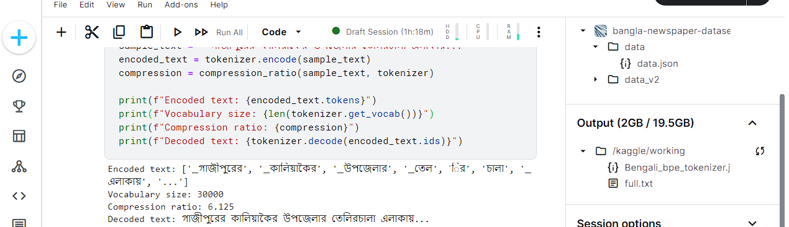

# BPE Tokenizer for Bengali Dataset

This repository contains a Jupyter notebook implementing a Byte Pair Encoding (BPE) tokenizer. The goal of this project is to achieve a compression ratio greater than 3 for a Bengali dataset.

## Table of Contents
- [Introduction](#introduction)
- [Requirements](#requirements)
- [Usage](#usage)
- [File Structure](#file-structure)
- [Implementation Details](#implementation-details)
- [Results](#results)
- [Contributing](#contributing)
- [License](#license)

## Introduction
Byte Pair Encoding (BPE) is a simple form of data compression that iteratively replaces the most frequent pair of bytes in a sequence with a single, unused byte. This project applies BPE to tokenize a Bengali dataset, aiming to achieve a compression ratio greater than 3.

## Requirements
To run the notebook, you will need the following packages:
- `numpy`
- `pandas`
- `collections`
- `re`
- `matplotlib`
- `jupyter`

You can install these packages using pip:
```bash
pip install numpy pandas collections re matplotlib jupyter
```

## Usage
1. Clone the repository:
    ```bash
    git clone https://github.com/yourusername/bpe-tokenizer-bengali.git
    ```
2. Navigate to the repository directory:
    ```bash
    cd bpe-tokenizer-bengali
    ```
3. Open the Jupyter notebook:
    ```bash
    jupyter notebook S20_Bangla.ipynb
    ```
4. Run the cells in the notebook to execute the BPE tokenizer and analyze the compression ratio.

## File Structure
- `S20_Bangla.ipynb`: The main Jupyter notebook containing the BPE tokenizer implementation.

## Implementation Details
The notebook is structured as follows:
1. **Introduction**: Overview of BPE and the goal of the project.
2. **Data Loading**: Load the Bengali dataset.
3. **Preprocessing**: Preprocess the data to prepare it for tokenization.
4. **BPE Tokenizer Implementation**: Detailed implementation of the BPE algorithm.
5. **Compression Analysis**: Calculate and analyze the compression ratio achieved.


### Key Steps in BPE Implementation:
- Initialize the vocabulary with all characters in the dataset.
- Count the frequency of each pair of characters.
- Merge the most frequent pair.
- Repeat until the desired number of merges is achieved.

### Compression Ratio Calculation:
- The compression ratio is calculated as the size of the original dataset divided by the size of the tokenized dataset.

## Training
the tokenization compression ratio looked like :



## Results
The notebook demonstrates the application of BPE on a Bengali dataset, aiming to achieve a compression ratio greater than 3. The results section in the notebook shows the achieved compression ratio and provides visualizations to support the findings.

## Contributing
Contributions are welcome! Please fork the repository and submit a pull request with your improvements.

