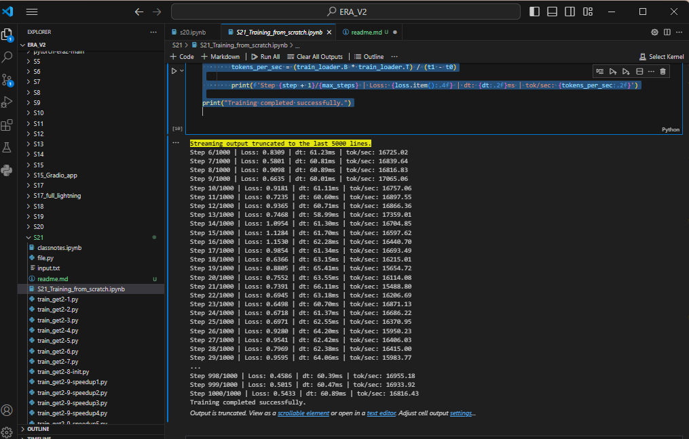
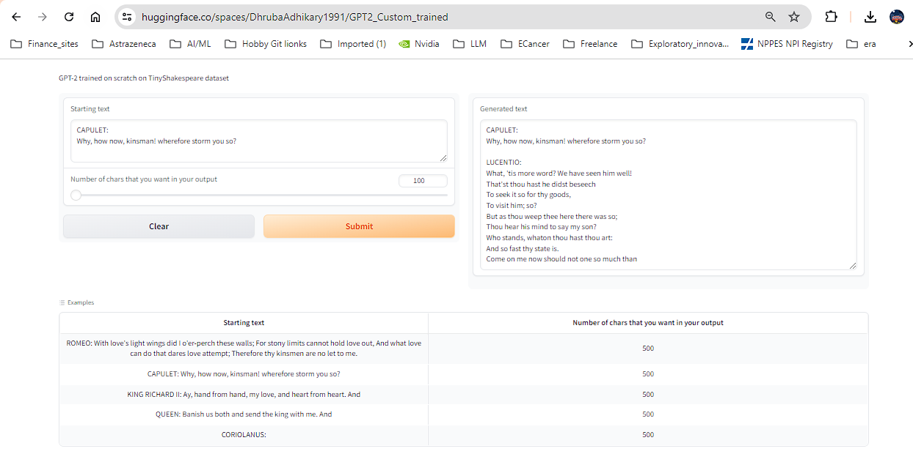

# GPT Training with Cosine Learning Rate Decay and Mixed Precision

This repository contains a GPT model implementation with several advanced features, including:
- Cosine learning rate decay schedule
- Automatic mixed precision training
- Learning rate adjustments at each step
- Enhanced logging of training statistics
- Custom weight initialization logic

## Features

1. **Cosine Learning Rate Decay**: Implements a learning rate schedule that starts with a warmup phase followed by a cosine decay to help stabilize training.
2. **Automatic Mixed Precision**: Uses `torch.autocast` to enable mixed precision training, which improves training speed and reduces memory usage.
3. **Dynamic Learning Rate Adjustment**: Adjusts the learning rate at each training step based on the cosine decay schedule.
4. **Enhanced Logging**: Logs the loss, time taken per step, and tokens processed per second for detailed performance monitoring.
5. **Custom Weight Initialization**: Applies specific initialization logic if `NANGPT_SCALE_INIT` is present, scaling the initialization standard deviation based on the number of layers.

## Training Screenshot

## Training was done on COlab T4 so :

params were adapted : 
block_size: int = 1024  # reduced max sequence length to fit into 4GB GPU
vocab_size: int = 50304  # number of tokens
n_layer: int = 6  # increased number of layers for better learning
n_head: int = 8  # increased number of heads for better learning
n_embd: int = 256  # increased embedding dimension for better learning

1. **IPYNB files** -> S21_Training_from_scratch.ipynb
2. **Python File** -> S21_main.py

## Hugging Face App link and Screenshot :
**App link** https://huggingface.co/spaces/DhrubaAdhikary1991/GPT2_Custom_trained
**Screenshot **

## Training Logs 

Till EPOCH 20 
Epoch 20/20
Step 1/1000 | Loss: 0.6583 | dt: 65.58ms | tok/sec: 15615.17
Step 2/1000 | Loss: 0.7957 | dt: 65.53ms | tok/sec: 15626.59
Step 3/1000 | Loss: 0.6801 | dt: 66.04ms | tok/sec: 15505.19
Step 4/1000 | Loss: 0.5282 | dt: 63.85ms | tok/sec: 16036.53
Step 5/1000 | Loss: 0.3852 | dt: 63.17ms | tok/sec: 16210.48
Step 6/1000 | Loss: 0.5379 | dt: 62.96ms | tok/sec: 16264.56
Step 7/1000 | Loss: 0.3804 | dt: 64.48ms | tok/sec: 15881.29
Step 8/1000 | Loss: 0.4961 | dt: 66.99ms | tok/sec: 15285.13
Step 9/1000 | Loss: 0.5389 | dt: 64.15ms | tok/sec: 15962.03
Step 10/1000 | Loss: 0.4967 | dt: 63.45ms | tok/sec: 16137.88
Step 11/1000 | Loss: 0.4608 | dt: 62.43ms | tok/sec: 16402.83
Step 12/1000 | Loss: 0.3466 | dt: 62.78ms | tok/sec: 16311.88
Step 13/1000 | Loss: 0.4596 | dt: 64.17ms | tok/sec: 15958.71
Step 14/1000 | Loss: 0.6427 | dt: 66.35ms | tok/sec: 15432.31
Step 15/1000 | Loss: 0.4641 | dt: 65.55ms | tok/sec: 15622.49
Step 16/1000 | Loss: 0.3250 | dt: 63.84ms | tok/sec: 16040.18
Step 17/1000 | Loss: 0.5158 | dt: 63.16ms | tok/sec: 16212.81
Step 18/1000 | Loss: 0.5598 | dt: 62.34ms | tok/sec: 16426.36
Step 19/1000 | Loss: 0.6524 | dt: 66.20ms | tok/sec: 15467.55
Step 20/1000 | Loss: 0.4796 | dt: 66.20ms | tok/sec: 15467.83
Step 21/1000 | Loss: 0.6924 | dt: 63.61ms | tok/sec: 16096.99
Step 22/1000 | Loss: 0.6549 | dt: 61.61ms | tok/sec: 16619.40
Step 23/1000 | Loss: 0.6619 | dt: 63.90ms | tok/sec: 16025.58
Step 24/1000 | Loss: 0.4623 | dt: 62.86ms | tok/sec: 16289.36
Step 25/1000 | Loss: 0.4846 | dt: 65.84ms | tok/sec: 15552.40
Step 26/1000 | Loss: 0.5655 | dt: 66.06ms | tok/sec: 15501.16
Step 27/1000 | Loss: 0.4641 | dt: 65.76ms | tok/sec: 15572.25
Step 28/1000 | Loss: 0.6215 | dt: 63.25ms | tok/sec: 16189.10
Step 29/1000 | Loss: 0.4020 | dt: 62.30ms | tok/sec: 16437.23
Step 30/1000 | Loss: 0.4854 | dt: 64.42ms | tok/sec: 15896.75
Step 31/1000 | Loss: 0.4886 | dt: 66.97ms | tok/sec: 15290.73
Step 32/1000 | Loss: 0.8198 | dt: 65.16ms | tok/sec: 15714.12
Step 33/1000 | Loss: 0.5826 | dt: 64.53ms | tok/sec: 15869.26
Step 34/1000 | Loss: 0.7509 | dt: 62.59ms | tok/sec: 16361.47
Step 35/1000 | Loss: 0.6850 | dt: 63.47ms | tok/sec: 16134.67
Step 36/1000 | Loss: 0.9192 | dt: 66.52ms | tok/sec: 15392.93
Step 37/1000 | Loss: 0.9474 | dt: 66.50ms | tok/sec: 15398.62
Step 38/1000 | Loss: 0.8918 | dt: 63.74ms | tok/sec: 16064.42
Step 39/1000 | Loss: 0.6838 | dt: 64.67ms | tok/sec: 15833.69
Step 40/1000 | Loss: 0.7505 | dt: 63.54ms | tok/sec: 16116.20
Step 41/1000 | Loss: 0.7111 | dt: 66.59ms | tok/sec: 15377.67
Step 42/1000 | Loss: 1.0473 | dt: 65.69ms | tok/sec: 15588.02
Step 43/1000 | Loss: 0.6407 | dt: 64.06ms | tok/sec: 15984.01
Step 44/1000 | Loss: 0.5937 | dt: 62.87ms | tok/sec: 16286.46
Step 45/1000 | Loss: 0.6098 | dt: 62.65ms | tok/sec: 16344.10
Step 46/1000 | Loss: 0.6887 | dt: 65.36ms | tok/sec: 15666.20
Step 47/1000 | Loss: 0.8132 | dt: 66.29ms | tok/sec: 15446.19
Step 48/1000 | Loss: 0.7295 | dt: 64.99ms | tok/sec: 15756.61
Step 49/1000 | Loss: 0.8165 | dt: 63.35ms | tok/sec: 16165.09
Step 50/1000 | Loss: 0.8248 | dt: 62.58ms | tok/sec: 16363.40
Step 51/1000 | Loss: 0.8293 | dt: 63.16ms | tok/sec: 16212.99
Step 52/1000 | Loss: 0.7906 | dt: 66.00ms | tok/sec: 15515.83
Step 53/1000 | Loss: 0.7276 | dt: 65.09ms | tok/sec: 15732.37
Step 54/1000 | Loss: 1.2925 | dt: 64.51ms | tok/sec: 15874.42
Step 55/1000 | Loss: 0.9984 | dt: 63.89ms | tok/sec: 16027.31
Step 56/1000 | Loss: 0.7041 | dt: 63.97ms | tok/sec: 16007.78
Step 57/1000 | Loss: 0.8481 | dt: 65.67ms | tok/sec: 15593.00
Step 58/1000 | Loss: 0.9576 | dt: 66.04ms | tok/sec: 15504.74
Step 59/1000 | Loss: 0.8605 | dt: 64.69ms | tok/sec: 15830.01
Step 60/1000 | Loss: 1.1112 | dt: 62.94ms | tok/sec: 16270.54
Step 61/1000 | Loss: 1.1128 | dt: 62.57ms | tok/sec: 16365.27
Step 62/1000 | Loss: 1.0679 | dt: 64.31ms | tok/sec: 15922.32
Step 63/1000 | Loss: 0.8276 | dt: 66.06ms | tok/sec: 15500.09
Step 64/1000 | Loss: 0.9243 | dt: 65.80ms | tok/sec: 15562.60
Step 65/1000 | Loss: 0.9045 | dt: 63.61ms | tok/sec: 16097.96
Step 66/1000 | Loss: 0.9100 | dt: 62.36ms | tok/sec: 16419.89
Step 67/1000 | Loss: 0.7035 | dt: 63.15ms | tok/sec: 16215.32
Step 68/1000 | Loss: 0.7080 | dt: 65.15ms | tok/sec: 15716.53
Step 69/1000 | Loss: 0.7573 | dt: 65.80ms | tok/sec: 15561.14
Step 70/1000 | Loss: 0.7178 | dt: 64.70ms | tok/sec: 15827.33
Step 71/1000 | Loss: 0.6335 | dt: 64.10ms | tok/sec: 15974.68
Step 72/1000 | Loss: 0.7250 | dt: 62.81ms | tok/sec: 16302.41
Step 73/1000 | Loss: 0.7681 | dt: 62.76ms | tok/sec: 16315.79
Step 74/1000 | Loss: 0.7563 | dt: 65.53ms | tok/sec: 15625.28
Step 75/1000 | Loss: 1.0088 | dt: 65.94ms | tok/sec: 15528.51
Step 76/1000 | Loss: 1.1606 | dt: 65.30ms | tok/sec: 15682.10
Step 77/1000 | Loss: 1.0000 | dt: 62.79ms | tok/sec: 16309.34
Step 78/1000 | Loss: 0.8824 | dt: 65.17ms | tok/sec: 15711.59
Step 79/1000 | Loss: 1.0212 | dt: 68.97ms | tok/sec: 14847.45
Step 80/1000 | Loss: 1.2191 | dt: 64.63ms | tok/sec: 15842.98
Step 81/1000 | Loss: 0.9540 | dt: 63.44ms | tok/sec: 16141.40
Step 82/1000 | Loss: 0.8248 | dt: 63.22ms | tok/sec: 16198.01
Step 83/1000 | Loss: 1.0559 | dt: 65.69ms | tok/sec: 15589.32
Step 84/1000 | Loss: 1.1819 | dt: 66.15ms | tok/sec: 15479.98
Step 85/1000 | Loss: 0.7268 | dt: 64.27ms | tok/sec: 15931.89
Step 86/1000 | Loss: 0.7845 | dt: 63.47ms | tok/sec: 16132.97
Step 87/1000 | Loss: 0.8541 | dt: 67.51ms | tok/sec: 15167.13
Step 88/1000 | Loss: 0.7345 | dt: 65.81ms | tok/sec: 15559.56
Step 89/1000 | Loss: 0.7954 | dt: 64.79ms | tok/sec: 15804.61
Step 90/1000 | Loss: 0.7634 | dt: 62.27ms | tok/sec: 16443.47
Step 91/1000 | Loss: 0.7659 | dt: 61.76ms | tok/sec: 16579.43
Step 92/1000 | Loss: 1.0599 | dt: 63.94ms | tok/sec: 16014.29
Step 93/1000 | Loss: 0.6200 | dt: 66.43ms | tok/sec: 15413.65
Step 94/1000 | Loss: 1.1772 | dt: 64.79ms | tok/sec: 15805.02
Step 95/1000 | Loss: 1.0414 | dt: 71.40ms | tok/sec: 14342.04
Step 96/1000 | Loss: 1.2575 | dt: 68.99ms | tok/sec: 14842.01
Step 97/1000 | Loss: 0.9328 | dt: 64.55ms | tok/sec: 15863.98
Step 98/1000 | Loss: 1.4396 | dt: 63.14ms | tok/sec: 16219.11
Step 99/1000 | Loss: 1.1505 | dt: 68.70ms | tok/sec: 14906.35
Step 100/1000 | Loss: 1.2239 | dt: 66.06ms | tok/sec: 15500.04
Step 101/1000 | Loss: 1.0340 | dt: 63.99ms | tok/sec: 16003.43
Step 102/1000 | Loss: 0.9898 | dt: 64.36ms | tok/sec: 15911.12
Step 103/1000 | Loss: 1.1078 | dt: 67.04ms | tok/sec: 15274.20
Step 104/1000 | Loss: 0.6930 | dt: 65.44ms | tok/sec: 15647.37
Step 105/1000 | Loss: 0.7750 | dt: 64.05ms | tok/sec: 15986.51
Step 106/1000 | Loss: 0.9068 | dt: 63.79ms | tok/sec: 16051.75
Step 107/1000 | Loss: 0.7982 | dt: 68.77ms | tok/sec: 14889.56
Step 108/1000 | Loss: 0.5178 | dt: 65.93ms | tok/sec: 15531.76
Step 109/1000 | Loss: 0.8904 | dt: 63.54ms | tok/sec: 16117.05
Step 110/1000 | Loss: 1.0979 | dt: 62.99ms | tok/sec: 16255.27
Step 111/1000 | Loss: 1.2424 | dt: 64.14ms | tok/sec: 15965.06
Step 112/1000 | Loss: 0.8264 | dt: 67.28ms | tok/sec: 15220.34
Step 113/1000 | Loss: 0.9344 | dt: 65.16ms | tok/sec: 15715.33
Step 114/1000 | Loss: 0.9174 | dt: 63.12ms | tok/sec: 16223.95
Step 115/1000 | Loss: 0.8293 | dt: 62.33ms | tok/sec: 16427.49
Step 116/1000 | Loss: 1.1112 | dt: 62.52ms | tok/sec: 16379.75
Step 117/1000 | Loss: 1.1525 | dt: 64.32ms | tok/sec: 15921.08
Step 118/1000 | Loss: 0.9244 | dt: 66.38ms | tok/sec: 15426.55
Step 119/1000 | Loss: 0.7260 | dt: 66.18ms | tok/sec: 15473.18
Step 120/1000 | Loss: 0.7388 | dt: 63.70ms | tok/sec: 16076.39
Step 121/1000 | Loss: 1.0165 | dt: 63.08ms | tok/sec: 16232.11
Step 122/1000 | Loss: 0.8365 | dt: 63.25ms | tok/sec: 16189.34
Step 123/1000 | Loss: 0.7534 | dt: 65.96ms | tok/sec: 15525.53
Step 124/1000 | Loss: 0.7908 | dt: 66.37ms | tok/sec: 15428.21
Step 125/1000 | Loss: 0.7423 | dt: 64.18ms | tok/sec: 15955.80
Step 126/1000 | Loss: 0.8403 | dt: 62.49ms | tok/sec: 16387.88
Step 127/1000 | Loss: 0.7080 | dt: 63.94ms | tok/sec: 16016.26
Step 128/1000 | Loss: 0.5864 | dt: 66.50ms | tok/sec: 15397.85
Step 129/1000 | Loss: 0.7719 | dt: 66.14ms | tok/sec: 15483.39
Step 130/1000 | Loss: 1.1652 | dt: 64.55ms | tok/sec: 15863.46
Step 131/1000 | Loss: 1.1847 | dt: 63.44ms | tok/sec: 16141.88
Step 132/1000 | Loss: 1.2803 | dt: 63.65ms | tok/sec: 16089.21
Step 133/1000 | Loss: 1.4915 | dt: 65.92ms | tok/sec: 15533.45
Step 134/1000 | Loss: 1.1337 | dt: 65.03ms | tok/sec: 15746.04
Step 135/1000 | Loss: 1.4285 | dt: 63.78ms | tok/sec: 16054.81
Step 136/1000 | Loss: 1.3294 | dt: 63.52ms | tok/sec: 16121.04
Step 137/1000 | Loss: 1.0261 | dt: 62.07ms | tok/sec: 16497.02
Step 138/1000 | Loss: 1.2145 | dt: 63.85ms | tok/sec: 16038.39
Step 139/1000 | Loss: 1.0237 | dt: 67.02ms | tok/sec: 15280.07
Step 140/1000 | Loss: 1.0103 | dt: 66.46ms | tok/sec: 15408.67
Step 141/1000 | Loss: 1.6101 | dt: 63.70ms | tok/sec: 16074.70
Step 142/1000 | Loss: 1.3643 | dt: 62.01ms | tok/sec: 16512.18
Step 143/1000 | Loss: 1.6751 | dt: 62.94ms | tok/sec: 16269.06
Step 144/1000 | Loss: 1.3430 | dt: 65.55ms | tok/sec: 15622.10
Step 145/1000 | Loss: 1.1671 | dt: 66.18ms | tok/sec: 15472.84
Step 146/1000 | Loss: 1.1244 | dt: 64.18ms | tok/sec: 15953.97
Step 147/1000 | Loss: 1.5333 | dt: 64.03ms | tok/sec: 15993.41
Step 148/1000 | Loss: 1.3035 | dt: 62.96ms | tok/sec: 16265.06
Step 149/1000 | Loss: 1.3583 | dt: 64.94ms | tok/sec: 15769.45
Step 150/1000 | Loss: 1.1917 | dt: 66.24ms | tok/sec: 15458.09
Step 151/1000 | Loss: 1.2804 | dt: 63.21ms | tok/sec: 16199.23
Step 152/1000 | Loss: 1.7174 | dt: 64.52ms | tok/sec: 15871.78
Step 153/1000 | Loss: 1.1618 | dt: 61.51ms | tok/sec: 16646.77
Step 154/1000 | Loss: 1.4650 | dt: 63.00ms | tok/sec: 16253.79
Step 155/1000 | Loss: 1.2476 | dt: 63.10ms | tok/sec: 16229.35
Step 156/1000 | Loss: 1.1892 | dt: 65.00ms | tok/sec: 15753.31
Step 157/1000 | Loss: 1.1306 | dt: 65.91ms | tok/sec: 15535.19
Step 158/1000 | Loss: 1.2590 | dt: 65.30ms | tok/sec: 15680.39
Step 159/1000 | Loss: 1.0845 | dt: 63.86ms | tok/sec: 16034.91
Step 160/1000 | Loss: 1.2690 | dt: 63.00ms | tok/sec: 16252.93
Step 161/1000 | Loss: 0.8855 | dt: 65.26ms | tok/sec: 15692.13
Step 162/1000 | Loss: 1.3496 | dt: 67.00ms | tok/sec: 15282.57
Step 163/1000 | Loss: 0.9693 | dt: 63.87ms | tok/sec: 16032.28
Step 164/1000 | Loss: 0.8194 | dt: 63.57ms | tok/sec: 16107.56
Step 165/1000 | Loss: 1.1261 | dt: 62.96ms | tok/sec: 16264.38
Step 166/1000 | Loss: 0.9523 | dt: 64.17ms | tok/sec: 15957.23
Step 167/1000 | Loss: 1.0736 | dt: 67.02ms | tok/sec: 15278.44
Step 168/1000 | Loss: 1.0385 | dt: 66.26ms | tok/sec: 15454.47
Step 169/1000 | Loss: 1.0378 | dt: 63.66ms | tok/sec: 16086.62
Step 170/1000 | Loss: 0.9407 | dt: 63.03ms | tok/sec: 16246.35
Step 171/1000 | Loss: 1.3431 | dt: 65.16ms | tok/sec: 15716.13
Step 172/1000 | Loss: 1.1780 | dt: 65.88ms | tok/sec: 15542.61
Step 173/1000 | Loss: 1.1268 | dt: 65.09ms | tok/sec: 15730.87
Step 174/1000 | Loss: 1.0630 | dt: 63.52ms | tok/sec: 16122.07
Step 175/1000 | Loss: 1.1734 | dt: 64.48ms | tok/sec: 15880.88
Step 176/1000 | Loss: 1.0815 | dt: 65.59ms | tok/sec: 15611.31
Step 177/1000 | Loss: 1.1003 | dt: 65.21ms | tok/sec: 15702.05
Step 178/1000 | Loss: 1.2650 | dt: 64.62ms | tok/sec: 15845.55
Step 179/1000 | Loss: 0.9416 | dt: 64.12ms | tok/sec: 15971.17
Step 180/1000 | Loss: 1.5206 | dt: 62.39ms | tok/sec: 16412.86
Step 181/1000 | Loss: 1.3093 | dt: 64.03ms | tok/sec: 15991.27
Step 182/1000 | Loss: 1.3651 | dt: 66.10ms | tok/sec: 15492.43
Step 183/1000 | Loss: 1.2397 | dt: 64.57ms | tok/sec: 15858.18
Step 184/1000 | Loss: 1.5083 | dt: 65.24ms | tok/sec: 15695.97
Step 185/1000 | Loss: 1.3592 | dt: 63.01ms | tok/sec: 16251.52
Step 186/1000 | Loss: 1.2659 | dt: 64.14ms | tok/sec: 15965.53
Step 187/1000 | Loss: 1.6184 | dt: 66.32ms | tok/sec: 15439.64
Step 188/1000 | Loss: 1.1454 | dt: 66.22ms | tok/sec: 15462.93
Step 189/1000 | Loss: 1.4671 | dt: 63.45ms | tok/sec: 16139.64
Step 190/1000 | Loss: 0.9265 | dt: 62.80ms | tok/sec: 16305.69
Step 191/1000 | Loss: 0.7152 | dt: 62.62ms | tok/sec: 16351.50
Step 192/1000 | Loss: 1.0727 | dt: 65.19ms | tok/sec: 15707.91
Step 193/1000 | Loss: 1.4938 | dt: 66.26ms | tok/sec: 15453.47
Step 194/1000 | Loss: 1.0126 | dt: 64.19ms | tok/sec: 15951.77
Step 195/1000 | Loss: 1.1222 | dt: 63.98ms | tok/sec: 16006.05
Step 196/1000 | Loss: 1.0841 | dt: 62.08ms | tok/sec: 16495.38
Step 197/1000 | Loss: 1.1897 | dt: 62.69ms | tok/sec: 16334.09
Step 198/1000 | Loss: 1.4134 | dt: 65.80ms | tok/sec: 15563.00
Step 199/1000 | Loss: 1.2884 | dt: 65.62ms | tok/sec: 15604.67
Step 200/1000 | Loss: 1.1617 | dt: 65.09ms | tok/sec: 15730.87
Step 201/1000 | Loss: 1.2797 | dt: 63.47ms | tok/sec: 16132.67
Step 202/1000 | Loss: 1.1466 | dt: 62.76ms | tok/sec: 16317.21
Step 203/1000 | Loss: 1.2889 | dt: 64.39ms | tok/sec: 15902.46
Step 204/1000 | Loss: 1.1620 | dt: 66.64ms | tok/sec: 15365.02
Step 205/1000 | Loss: 1.1385 | dt: 66.00ms | tok/sec: 15515.66
Step 206/1000 | Loss: 0.9911 | dt: 63.51ms | tok/sec: 16123.10
Step 207/1000 | Loss: 1.1511 | dt: 62.99ms | tok/sec: 16256.87
Step 208/1000 | Loss: 0.8143 | dt: 63.01ms | tok/sec: 16252.44
Step 209/1000 | Loss: 1.0099 | dt: 65.74ms | tok/sec: 15576.21
Step 210/1000 | Loss: 1.0466 | dt: 65.76ms | tok/sec: 15571.35
Step 211/1000 | Loss: 1.0844 | dt: 64.39ms | tok/sec: 15902.46
Step 212/1000 | Loss: 1.1594 | dt: 63.46ms | tok/sec: 16136.42
Step 213/1000 | Loss: 1.2663 | dt: 62.41ms | tok/sec: 16408.29
Step 214/1000 | Loss: 1.5063 | dt: 64.16ms | tok/sec: 15958.89
Step 215/1000 | Loss: 1.2293 | dt: 66.39ms | tok/sec: 15424.72
Step 216/1000 | Loss: 1.3584 | dt: 65.21ms | tok/sec: 15702.28
Step 217/1000 | Loss: 1.1383 | dt: 64.20ms | tok/sec: 15949.40
Step 218/1000 | Loss: 1.1204 | dt: 62.69ms | tok/sec: 16335.21
Step 219/1000 | Loss: 1.1404 | dt: 63.71ms | tok/sec: 16073.08
Step 220/1000 | Loss: 1.1360 | dt: 66.59ms | tok/sec: 15376.95
Step 221/1000 | Loss: 1.5252 | dt: 65.22ms | tok/sec: 15701.71
Step 222/1000 | Loss: 1.1302 | dt: 64.92ms | tok/sec: 15774.08
Step 223/1000 | Loss: 0.9219 | dt: 67.02ms | tok/sec: 15278.33
Step 224/1000 | Loss: 1.1601 | dt: 66.03ms | tok/sec: 15507.48
Step 225/1000 | Loss: 0.8197 | dt: 66.32ms | tok/sec: 15440.64
Step 226/1000 | Loss: 0.9803 | dt: 64.10ms | tok/sec: 15975.15
Step 227/1000 | Loss: 0.9430 | dt: 62.72ms | tok/sec: 16327.26
Step 228/1000 | Loss: 1.1872 | dt: 64.61ms | tok/sec: 15849.35
Step 229/1000 | Loss: 1.6917 | dt: 66.21ms | tok/sec: 15466.32
Step 230/1000 | Loss: 1.5746 | dt: 65.63ms | tok/sec: 15603.25
Step 231/1000 | Loss: 1.4764 | dt: 64.41ms | tok/sec: 15898.04
Step 232/1000 | Loss: 1.3011 | dt: 63.29ms | tok/sec: 16178.42
Step 233/1000 | Loss: 1.2708 | dt: 63.51ms | tok/sec: 16122.31
Step 234/1000 | Loss: 1.6432 | dt: 65.27ms | tok/sec: 15688.46
Step 235/1000 | Loss: 1.5733 | dt: 64.79ms | tok/sec: 15805.55
Step 236/1000 | Loss: 1.6435 | dt: 64.21ms | tok/sec: 15947.45
Step 237/1000 | Loss: 1.6449 | dt: 63.25ms | tok/sec: 16189.34
Step 238/1000 | Loss: 1.6117 | dt: 62.60ms | tok/sec: 16356.55
Step 239/1000 | Loss: 1.7182 | dt: 65.76ms | tok/sec: 15572.87
Step 240/1000 | Loss: 1.4003 | dt: 66.43ms | tok/sec: 15413.76
Step 241/1000 | Loss: 1.3250 | dt: 65.84ms | tok/sec: 15551.84
Step 242/1000 | Loss: 1.6790 | dt: 63.60ms | tok/sec: 16099.65
Step 243/1000 | Loss: 1.5161 | dt: 64.60ms | tok/sec: 15851.98
Step 244/1000 | Loss: 1.4860 | dt: 66.16ms | tok/sec: 15478.36
Step 245/1000 | Loss: 1.5442 | dt: 66.56ms | tok/sec: 15384.61
Step 246/1000 | Loss: 1.6921 | dt: 63.95ms | tok/sec: 16012.37
Step 247/1000 | Loss: 1.3166 | dt: 64.04ms | tok/sec: 15989.42
Step 248/1000 | Loss: 1.4369 | dt: 65.71ms | tok/sec: 15582.59
Step 249/1000 | Loss: 1.0527 | dt: 65.55ms | tok/sec: 15622.61
Step 250/1000 | Loss: 1.2384 | dt: 65.43ms | tok/sec: 15649.36
Step 251/1000 | Loss: 1.3397 | dt: 63.82ms | tok/sec: 16045.52
Step 252/1000 | Loss: 1.5189 | dt: 63.14ms | tok/sec: 16218.81
Step 253/1000 | Loss: 1.5928 | dt: 64.47ms | tok/sec: 15882.52
Step 254/1000 | Loss: 1.2073 | dt: 66.29ms | tok/sec: 15446.41
Step 255/1000 | Loss: 1.3840 | dt: 66.68ms | tok/sec: 15356.66
Step 256/1000 | Loss: 1.0319 | dt: 63.35ms | tok/sec: 16164.36
Step 257/1000 | Loss: 1.5751 | dt: 62.76ms | tok/sec: 16316.28
Step 258/1000 | Loss: 1.0337 | dt: 65.23ms | tok/sec: 15697.52
Step 259/1000 | Loss: 1.3778 | dt: 66.21ms | tok/sec: 15465.27
Step 260/1000 | Loss: 1.1294 | dt: 65.30ms | tok/sec: 15680.84
Step 261/1000 | Loss: 1.1056 | dt: 62.94ms | tok/sec: 16269.37
Step 262/1000 | Loss: 1.0907 | dt: 62.98ms | tok/sec: 16259.08
Step 263/1000 | Loss: 1.2562 | dt: 66.61ms | tok/sec: 15374.04
Step 264/1000 | Loss: 0.9120 | dt: 66.49ms | tok/sec: 15400.22
Step 265/1000 | Loss: 0.7404 | dt: 63.83ms | tok/sec: 16042.94
Step 266/1000 | Loss: 0.8367 | dt: 65.43ms | tok/sec: 15650.10
Step 267/1000 | Loss: 0.7849 | dt: 68.49ms | tok/sec: 14951.71
Step 268/1000 | Loss: 1.4601 | dt: 66.25ms | tok/sec: 15455.47
Step 269/1000 | Loss: 1.2646 | dt: 64.15ms | tok/sec: 15963.81
Step 270/1000 | Loss: 1.3628 | dt: 63.80ms | tok/sec: 16050.79
Step 271/1000 | Loss: 1.6578 | dt: 67.32ms | tok/sec: 15211.88
Step 272/1000 | Loss: 1.1738 | dt: 66.33ms | tok/sec: 15438.75
Step 273/1000 | Loss: 1.4538 | dt: 63.59ms | tok/sec: 16103.81
Step 274/1000 | Loss: 1.4713 | dt: 63.89ms | tok/sec: 16027.73
Step 275/1000 | Loss: 1.2585 | dt: 66.53ms | tok/sec: 15392.33
Step 276/1000 | Loss: 1.3720 | dt: 65.84ms | tok/sec: 15553.87
Step 277/1000 | Loss: 1.9000 | dt: 63.76ms | tok/sec: 16059.98
Step 278/1000 | Loss: 1.2472 | dt: 64.62ms | tok/sec: 15845.66
Step 279/1000 | Loss: 1.0393 | dt: 67.33ms | tok/sec: 15209.78
Step 280/1000 | Loss: 1.3376 | dt: 65.90ms | tok/sec: 15537.66
Step 281/1000 | Loss: 1.0988 | dt: 64.18ms | tok/sec: 15954.26
Step 282/1000 | Loss: 1.0010 | dt: 63.38ms | tok/sec: 16157.67
Step 283/1000 | Loss: 1.5609 | dt: 67.04ms | tok/sec: 15274.91
Step 284/1000 | Loss: 1.4566 | dt: 66.39ms | tok/sec: 15423.17
Step 285/1000 | Loss: 1.2418 | dt: 63.76ms | tok/sec: 16061.18
Step 286/1000 | Loss: 0.9966 | dt: 65.03ms | tok/sec: 15746.90
Step 287/1000 | Loss: 1.0708 | dt: 67.12ms | tok/sec: 15256.35
Step 288/1000 | Loss: 1.0562 | dt: 68.27ms | tok/sec: 14999.85
Step 289/1000 | Loss: 1.1482 | dt: 63.94ms | tok/sec: 16016.26
Step 290/1000 | Loss: 1.1215 | dt: 63.96ms | tok/sec: 16009.09
Step 291/1000 | Loss: 1.5477 | dt: 71.68ms | tok/sec: 14286.46
Step 292/1000 | Loss: 1.1300 | dt: 65.12ms | tok/sec: 15723.78
Step 293/1000 | Loss: 1.1472 | dt: 62.68ms | tok/sec: 16336.70
Step 294/1000 | Loss: 1.0566 | dt: 61.36ms | tok/sec: 16687.20
Step 295/1000 | Loss: 0.9253 | dt: 64.17ms | tok/sec: 15958.71
Step 296/1000 | Loss: 1.0851 | dt: 66.54ms | tok/sec: 15388.96
Step 297/1000 | Loss: 0.7883 | dt: 65.59ms | tok/sec: 15612.16
Step 298/1000 | Loss: 1.2109 | dt: 63.55ms | tok/sec: 16113.18
Step 299/1000 | Loss: 0.7826 | dt: 62.58ms | tok/sec: 16364.21
Step 300/1000 | Loss: 1.0646 | dt: 62.78ms | tok/sec: 16309.71
Step 301/1000 | Loss: 0.9237 | dt: 64.94ms | tok/sec: 15767.71
Step 302/1000 | Loss: 1.1194 | dt: 65.89ms | tok/sec: 15540.75
Step 303/1000 | Loss: 0.8527 | dt: 64.65ms | tok/sec: 15838.36
Step 304/1000 | Loss: 1.3839 | dt: 62.63ms | tok/sec: 16350.82
Step 305/1000 | Loss: 1.4282 | dt: 62.87ms | tok/sec: 16288.50
Step 306/1000 | Loss: 1.3082 | dt: 63.51ms | tok/sec: 16123.88
Step 307/1000 | Loss: 1.1293 | dt: 65.65ms | tok/sec: 15597.08
Step 308/1000 | Loss: 0.8017 | dt: 65.73ms | tok/sec: 15577.90
Step 309/1000 | Loss: 1.0567 | dt: 63.99ms | tok/sec: 16001.76
Step 310/1000 | Loss: 0.9443 | dt: 63.41ms | tok/sec: 16149.29
Step 311/1000 | Loss: 1.0278 | dt: 62.90ms | tok/sec: 16280.53
Step 312/1000 | Loss: 0.9160 | dt: 64.31ms | tok/sec: 15923.86
Step 313/1000 | Loss: 0.8418 | dt: 66.33ms | tok/sec: 15438.64
Step 314/1000 | Loss: 0.7724 | dt: 65.05ms | tok/sec: 15742.17
Step 315/1000 | Loss: 0.8289 | dt: 64.18ms | tok/sec: 15956.22
Step 316/1000 | Loss: 1.0794 | dt: 62.42ms | tok/sec: 16404.28
Step 317/1000 | Loss: 1.0682 | dt: 62.86ms | tok/sec: 16289.67
Step 318/1000 | Loss: 0.9108 | dt: 66.27ms | tok/sec: 15451.08
Step 319/1000 | Loss: 1.0626 | dt: 66.05ms | tok/sec: 15504.57
Step 320/1000 | Loss: 0.8555 | dt: 64.39ms | tok/sec: 15904.22
Step 321/1000 | Loss: 0.7523 | dt: 62.86ms | tok/sec: 16290.85
Step 322/1000 | Loss: 0.7536 | dt: 62.45ms | tok/sec: 16396.45
Step 323/1000 | Loss: 0.8126 | dt: 63.44ms | tok/sec: 16140.24
Step 324/1000 | Loss: 0.9524 | dt: 66.81ms | tok/sec: 15327.51
Step 325/1000 | Loss: 0.7932 | dt: 66.02ms | tok/sec: 15510.56
Step 326/1000 | Loss: 0.8976 | dt: 64.02ms | tok/sec: 15995.14
Step 327/1000 | Loss: 0.8616 | dt: 65.76ms | tok/sec: 15571.74
Step 328/1000 | Loss: 0.5572 | dt: 65.89ms | tok/sec: 15540.25
Step 329/1000 | Loss: 0.6138 | dt: 65.41ms | tok/sec: 15654.27
Step 330/1000 | Loss: 0.6424 | dt: 65.04ms | tok/sec: 15743.44
Step 331/1000 | Loss: 1.0317 | dt: 64.04ms | tok/sec: 15991.03
Step 332/1000 | Loss: 0.9955 | dt: 63.06ms | tok/sec: 16238.98
Step 333/1000 | Loss: 0.7843 | dt: 65.15ms | tok/sec: 15716.99
Step 334/1000 | Loss: 0.5672 | dt: 65.99ms | tok/sec: 15518.35
Step 335/1000 | Loss: 0.5762 | dt: 66.81ms | tok/sec: 15327.45
Step 336/1000 | Loss: 0.6925 | dt: 63.01ms | tok/sec: 16250.96
Step 337/1000 | Loss: 0.5581 | dt: 64.17ms | tok/sec: 15957.05
Step 338/1000 | Loss: 0.6827 | dt: 65.83ms | tok/sec: 15556.12
Step 339/1000 | Loss: 0.7217 | dt: 65.17ms | tok/sec: 15712.57
Step 340/1000 | Loss: 0.6382 | dt: 64.17ms | tok/sec: 15958.12
Step 341/1000 | Loss: 0.7008 | dt: 63.81ms | tok/sec: 16048.51
Step 342/1000 | Loss: 0.5447 | dt: 62.87ms | tok/sec: 16287.82
Step 343/1000 | Loss: 0.6547 | dt: 65.45ms | tok/sec: 15644.80
Step 344/1000 | Loss: 0.9006 | dt: 67.06ms | tok/sec: 15269.31
Step 345/1000 | Loss: 0.6243 | dt: 64.08ms | tok/sec: 15980.20
Step 346/1000 | Loss: 0.4338 | dt: 63.55ms | tok/sec: 16112.57
Step 347/1000 | Loss: 0.7607 | dt: 62.84ms | tok/sec: 16294.12
Step 348/1000 | Loss: 0.7821 | dt: 67.65ms | tok/sec: 15137.73
Step 349/1000 | Loss: 1.0521 | dt: 66.26ms | tok/sec: 15454.86
Step 350/1000 | Loss: 0.9121 | dt: 64.19ms | tok/sec: 15952.90
Step 351/1000 | Loss: 1.1177 | dt: 63.14ms | tok/sec: 16217.28
Step 352/1000 | Loss: 1.0963 | dt: 64.29ms | tok/sec: 15928.17
Step 353/1000 | Loss: 1.1016 | dt: 66.60ms | tok/sec: 15376.35
Step 354/1000 | Loss: 0.8040 | dt: 65.22ms | tok/sec: 15700.16
Step 355/1000 | Loss: 0.8786 | dt: 67.38ms | tok/sec: 15197.78
Step 356/1000 | Loss: 0.8955 | dt: 64.19ms | tok/sec: 15952.96
Step 357/1000 | Loss: 0.7930 | dt: 66.12ms | tok/sec: 15487.85
Step 358/1000 | Loss: 0.9765 | dt: 65.29ms | tok/sec: 15684.22
Step 359/1000 | Loss: 0.7334 | dt: 64.95ms | tok/sec: 15765.22
Step 360/1000 | Loss: 0.7804 | dt: 62.51ms | tok/sec: 16382.50
Step 361/1000 | Loss: 0.7799 | dt: 63.39ms | tok/sec: 16155.18
Step 362/1000 | Loss: 1.1341 | dt: 66.13ms | tok/sec: 15485.34
Step 363/1000 | Loss: 0.8534 | dt: 65.65ms | tok/sec: 15598.04
Step 364/1000 | Loss: 0.9650 | dt: 64.62ms | tok/sec: 15846.07
Step 365/1000 | Loss: 0.9770 | dt: 63.22ms | tok/sec: 16197.40
Step 366/1000 | Loss: 1.2554 | dt: 63.18ms | tok/sec: 16208.52
Step 367/1000 | Loss: 1.2315 | dt: 65.57ms | tok/sec: 15618.01
Step 368/1000 | Loss: 1.1523 | dt: 67.09ms | tok/sec: 15262.31
Step 369/1000 | Loss: 0.9734 | dt: 64.16ms | tok/sec: 15960.61
Step 370/1000 | Loss: 1.0672 | dt: 63.46ms | tok/sec: 16136.54
Step 371/1000 | Loss: 0.9769 | dt: 63.20ms | tok/sec: 16202.65
Step 372/1000 | Loss: 1.3166 | dt: 65.92ms | tok/sec: 15533.28
Step 373/1000 | Loss: 0.8865 | dt: 64.27ms | tok/sec: 15932.66
Step 374/1000 | Loss: 0.8883 | dt: 64.51ms | tok/sec: 15872.66
Step 375/1000 | Loss: 0.8868 | dt: 63.54ms | tok/sec: 16115.72
Step 376/1000 | Loss: 0.8547 | dt: 62.88ms | tok/sec: 16284.92
Step 377/1000 | Loss: 1.0940 | dt: 62.76ms | tok/sec: 16315.17
Step 378/1000 | Loss: 0.9125 | dt: 64.66ms | tok/sec: 15837.43
Step 379/1000 | Loss: 0.9469 | dt: 66.59ms | tok/sec: 15378.77
Step 380/1000 | Loss: 1.0566 | dt: 65.12ms | tok/sec: 15724.13
Step 381/1000 | Loss: 0.9464 | dt: 63.07ms | tok/sec: 16235.54
Step 382/1000 | Loss: 1.0353 | dt: 63.06ms | tok/sec: 16238.74
Step 383/1000 | Loss: 0.8865 | dt: 63.41ms | tok/sec: 16150.08
Step 384/1000 | Loss: 1.4576 | dt: 65.89ms | tok/sec: 15541.15
Step 385/1000 | Loss: 1.1137 | dt: 66.06ms | tok/sec: 15501.66
Step 386/1000 | Loss: 0.8744 | dt: 64.52ms | tok/sec: 15870.14
Step 387/1000 | Loss: 0.9585 | dt: 63.79ms | tok/sec: 16052.65
Step 388/1000 | Loss: 1.0462 | dt: 63.47ms | tok/sec: 16132.67
Step 389/1000 | Loss: 0.9886 | dt: 65.13ms | tok/sec: 15723.55
Step 390/1000 | Loss: 1.1581 | dt: 65.70ms | tok/sec: 15585.36
Step 391/1000 | Loss: 1.2076 | dt: 64.89ms | tok/sec: 15779.65
Step 392/1000 | Loss: 1.2535 | dt: 62.00ms | tok/sec: 16517.45
Step 393/1000 | Loss: 0.9097 | dt: 63.47ms | tok/sec: 16133.15
Step 394/1000 | Loss: 0.9779 | dt: 64.01ms | tok/sec: 15996.63
Step 395/1000 | Loss: 0.8965 | dt: 65.82ms | tok/sec: 15556.40
Step 396/1000 | Loss: 0.9258 | dt: 66.72ms | tok/sec: 15347.34
Step 397/1000 | Loss: 0.8335 | dt: 64.46ms | tok/sec: 15886.99
Step 398/1000 | Loss: 0.8092 | dt: 63.19ms | tok/sec: 16205.65
Step 399/1000 | Loss: 0.8290 | dt: 63.24ms | tok/sec: 16193.12
Step 400/1000 | Loss: 0.8017 | dt: 66.03ms | tok/sec: 15508.15
Step 401/1000 | Loss: 0.7300 | dt: 66.09ms | tok/sec: 15495.12
Step 402/1000 | Loss: 0.8471 | dt: 64.45ms | tok/sec: 15888.51
Step 403/1000 | Loss: 0.8352 | dt: 62.44ms | tok/sec: 16400.14
Step 404/1000 | Loss: 0.9414 | dt: 63.27ms | tok/sec: 16183.42
Step 405/1000 | Loss: 1.0798 | dt: 66.01ms | tok/sec: 15513.03
Step 406/1000 | Loss: 1.2591 | dt: 65.59ms | tok/sec: 15612.50
Step 407/1000 | Loss: 1.0001 | dt: 63.81ms | tok/sec: 16047.25
Step 408/1000 | Loss: 0.9006 | dt: 64.04ms | tok/sec: 15989.78
Step 409/1000 | Loss: 1.0285 | dt: 62.67ms | tok/sec: 16339.93
Step 410/1000 | Loss: 1.2813 | dt: 64.21ms | tok/sec: 15947.86
Step 411/1000 | Loss: 0.9577 | dt: 66.66ms | tok/sec: 15362.65
Step 412/1000 | Loss: 0.9008 | dt: 66.12ms | tok/sec: 15487.63
Step 413/1000 | Loss: 1.1155 | dt: 64.10ms | tok/sec: 15974.68
Step 414/1000 | Loss: 1.1150 | dt: 66.73ms | tok/sec: 15346.29
Step 415/1000 | Loss: 0.8052 | dt: 66.33ms | tok/sec: 15436.97
Step 416/1000 | Loss: 0.8894 | dt: 65.40ms | tok/sec: 15658.32
Step 417/1000 | Loss: 0.9383 | dt: 63.94ms | tok/sec: 16015.42
Step 418/1000 | Loss: 0.8765 | dt: 63.34ms | tok/sec: 16167.22
Step 419/1000 | Loss: 0.8724 | dt: 63.29ms | tok/sec: 16179.40
Step 420/1000 | Loss: 0.8326 | dt: 65.65ms | tok/sec: 15597.42
Step 421/1000 | Loss: 0.8787 | dt: 65.55ms | tok/sec: 15622.38
Step 422/1000 | Loss: 1.1451 | dt: 64.98ms | tok/sec: 15758.40
Step 423/1000 | Loss: 0.7485 | dt: 62.95ms | tok/sec: 16267.64
Step 424/1000 | Loss: 1.3009 | dt: 63.10ms | tok/sec: 16228.43
Step 425/1000 | Loss: 1.1383 | dt: 64.76ms | tok/sec: 15812.64
Step 426/1000 | Loss: 1.3455 | dt: 66.41ms | tok/sec: 15420.51
Step 427/1000 | Loss: 1.0203 | dt: 65.94ms | tok/sec: 15529.74
Step 428/1000 | Loss: 1.4046 | dt: 63.77ms | tok/sec: 16057.99
Step 429/1000 | Loss: 1.1661 | dt: 62.54ms | tok/sec: 16374.82
Step 430/1000 | Loss: 1.1715 | dt: 66.81ms | tok/sec: 15327.02
Step 431/1000 | Loss: 1.0309 | dt: 65.18ms | tok/sec: 15710.21
Step 432/1000 | Loss: 1.0563 | dt: 65.33ms | tok/sec: 15675.46
Step 433/1000 | Loss: 1.1259 | dt: 63.74ms | tok/sec: 16064.18
Step 434/1000 | Loss: 0.7084 | dt: 62.86ms | tok/sec: 16290.85
Step 435/1000 | Loss: 0.7632 | dt: 64.73ms | tok/sec: 15820.16
Step 436/1000 | Loss: 0.9634 | dt: 65.83ms | tok/sec: 15555.33
Step 437/1000 | Loss: 0.8493 | dt: 65.81ms | tok/sec: 15560.97
Step 438/1000 | Loss: 0.5404 | dt: 63.24ms | tok/sec: 16191.66
Step 439/1000 | Loss: 0.7689 | dt: 62.77ms | tok/sec: 16313.80
Step 440/1000 | Loss: 0.9750 | dt: 63.34ms | tok/sec: 16166.12
Step 441/1000 | Loss: 1.2036 | dt: 65.35ms | tok/sec: 15669.29
Step 442/1000 | Loss: 0.7604 | dt: 65.50ms | tok/sec: 15633.87
Step 443/1000 | Loss: 0.8920 | dt: 65.47ms | tok/sec: 15639.62
Step 444/1000 | Loss: 0.8773 | dt: 63.45ms | tok/sec: 16139.52
Step 445/1000 | Loss: 0.8740 | dt: 61.89ms | tok/sec: 16546.34
Step 446/1000 | Loss: 1.1987 | dt: 63.04ms | tok/sec: 16244.51
Step 447/1000 | Loss: 1.0713 | dt: 67.47ms | tok/sec: 15177.69
Step 448/1000 | Loss: 0.8873 | dt: 65.31ms | tok/sec: 15680.16
Step 449/1000 | Loss: 0.7185 | dt: 64.38ms | tok/sec: 15904.34
Step 450/1000 | Loss: 0.7118 | dt: 62.60ms | tok/sec: 16358.42
Step 451/1000 | Loss: 0.9729 | dt: 62.78ms | tok/sec: 16309.96
Step 452/1000 | Loss: 0.8620 | dt: 65.50ms | tok/sec: 15634.61
Step 453/1000 | Loss: 0.7394 | dt: 64.48ms | tok/sec: 15881.93
Step 454/1000 | Loss: 0.7465 | dt: 64.15ms | tok/sec: 15962.39
Step 455/1000 | Loss: 0.7305 | dt: 64.47ms | tok/sec: 15883.34
Step 456/1000 | Loss: 0.7445 | dt: 68.67ms | tok/sec: 14911.37
Step 457/1000 | Loss: 0.6534 | dt: 65.27ms | tok/sec: 15689.09
Step 458/1000 | Loss: 0.5483 | dt: 63.32ms | tok/sec: 16171.42
Step 459/1000 | Loss: 0.7206 | dt: 64.16ms | tok/sec: 15961.02
Step 460/1000 | Loss: 1.1739 | dt: 62.50ms | tok/sec: 16385.25
Step 461/1000 | Loss: 1.2348 | dt: 70.60ms | tok/sec: 14504.14
Step 462/1000 | Loss: 1.1876 | dt: 63.93ms | tok/sec: 16016.97
Step 463/1000 | Loss: 1.3866 | dt: 73.61ms | tok/sec: 13911.91
Step 464/1000 | Loss: 1.0501 | dt: 64.68ms | tok/sec: 15830.95
Step 465/1000 | Loss: 1.2754 | dt: 62.35ms | tok/sec: 16424.29
Step 466/1000 | Loss: 1.1977 | dt: 62.35ms | tok/sec: 16423.09
Step 467/1000 | Loss: 0.8982 | dt: 62.52ms | tok/sec: 16378.00
Step 468/1000 | Loss: 1.1176 | dt: 63.23ms | tok/sec: 16194.10
Step 469/1000 | Loss: 0.9556 | dt: 66.59ms | tok/sec: 15378.27
Step 470/1000 | Loss: 0.9542 | dt: 65.72ms | tok/sec: 15581.57
Step 471/1000 | Loss: 1.3625 | dt: 69.44ms | tok/sec: 14747.53
Step 472/1000 | Loss: 1.1642 | dt: 66.24ms | tok/sec: 15458.42
Step 473/1000 | Loss: 1.5152 | dt: 65.02ms | tok/sec: 15748.98
Step 474/1000 | Loss: 1.1315 | dt: 64.21ms | tok/sec: 15948.22
Step 475/1000 | Loss: 1.0710 | dt: 66.12ms | tok/sec: 15487.18
Step 476/1000 | Loss: 0.9117 | dt: 67.54ms | tok/sec: 15160.97
Step 477/1000 | Loss: 1.3487 | dt: 64.23ms | tok/sec: 15941.95
Step 478/1000 | Loss: 1.1151 | dt: 64.36ms | tok/sec: 15911.23
Step 479/1000 | Loss: 1.1681 | dt: 64.66ms | tok/sec: 15837.19
Step 480/1000 | Loss: 1.0630 | dt: 65.88ms | tok/sec: 15543.79
Step 481/1000 | Loss: 1.1596 | dt: 65.13ms | tok/sec: 15721.37
Step 482/1000 | Loss: 1.6066 | dt: 64.81ms | tok/sec: 15799.38
Step 483/1000 | Loss: 0.9867 | dt: 63.81ms | tok/sec: 16048.39
Step 484/1000 | Loss: 1.2679 | dt: 62.67ms | tok/sec: 16338.75
Step 485/1000 | Loss: 1.1813 | dt: 63.63ms | tok/sec: 16092.77
Step 486/1000 | Loss: 1.0612 | dt: 66.67ms | tok/sec: 15359.36
Step 487/1000 | Loss: 1.0067 | dt: 66.20ms | tok/sec: 15467.61
Step 488/1000 | Loss: 1.1487 | dt: 63.71ms | tok/sec: 16073.38
Step 489/1000 | Loss: 0.8784 | dt: 63.05ms | tok/sec: 16240.95
Step 490/1000 | Loss: 1.0633 | dt: 61.76ms | tok/sec: 16579.17
Step 491/1000 | Loss: 0.7816 | dt: 65.26ms | tok/sec: 15691.27
Step 492/1000 | Loss: 1.1858 | dt: 68.14ms | tok/sec: 15027.82
Step 493/1000 | Loss: 0.8208 | dt: 64.51ms | tok/sec: 15872.48
Step 494/1000 | Loss: 0.6843 | dt: 62.62ms | tok/sec: 16351.44
Step 495/1000 | Loss: 0.9996 | dt: 62.35ms | tok/sec: 16423.91
Step 496/1000 | Loss: 0.7604 | dt: 63.66ms | tok/sec: 16086.32
Step 497/1000 | Loss: 0.8981 | dt: 66.37ms | tok/sec: 15428.54
Step 498/1000 | Loss: 0.8499 | dt: 65.84ms | tok/sec: 15551.84
Step 499/1000 | Loss: 0.8407 | dt: 64.16ms | tok/sec: 15960.25
Step 500/1000 | Loss: 0.8533 | dt: 63.24ms | tok/sec: 16191.42
Step 501/1000 | Loss: 1.1200 | dt: 62.51ms | tok/sec: 16381.88
Step 502/1000 | Loss: 0.9467 | dt: 64.17ms | tok/sec: 15958.53
Step 503/1000 | Loss: 0.9750 | dt: 66.35ms | tok/sec: 15434.03
Step 504/1000 | Loss: 0.8577 | dt: 65.79ms | tok/sec: 15565.14
Step 505/1000 | Loss: 0.9715 | dt: 63.26ms | tok/sec: 16187.02
Step 506/1000 | Loss: 0.9062 | dt: 62.51ms | tok/sec: 16381.69
Step 507/1000 | Loss: 0.8564 | dt: 62.70ms | tok/sec: 16331.67
Step 508/1000 | Loss: 0.9940 | dt: 66.00ms | tok/sec: 15515.49
Step 509/1000 | Loss: 0.7629 | dt: 67.13ms | tok/sec: 15253.15
Step 510/1000 | Loss: 1.2330 | dt: 63.67ms | tok/sec: 16082.65
Step 511/1000 | Loss: 1.1194 | dt: 62.60ms | tok/sec: 16357.17
Step 512/1000 | Loss: 1.1528 | dt: 62.57ms | tok/sec: 16364.90
Step 513/1000 | Loss: 1.0191 | dt: 63.90ms | tok/sec: 16024.08
Step 514/1000 | Loss: 1.3638 | dt: 66.52ms | tok/sec: 15394.20
Step 515/1000 | Loss: 1.1334 | dt: 65.56ms | tok/sec: 15619.09
Step 516/1000 | Loss: 1.0583 | dt: 63.94ms | tok/sec: 16014.35
Step 517/1000 | Loss: 1.2624 | dt: 63.47ms | tok/sec: 16133.33
Step 518/1000 | Loss: 0.8740 | dt: 62.73ms | tok/sec: 16323.85
Step 519/1000 | Loss: 1.1166 | dt: 65.14ms | tok/sec: 15720.91
Step 520/1000 | Loss: 0.6495 | dt: 66.58ms | tok/sec: 15379.21
Step 521/1000 | Loss: 0.5603 | dt: 64.13ms | tok/sec: 15967.73
Step 522/1000 | Loss: 0.8436 | dt: 64.56ms | tok/sec: 15860.35
Step 523/1000 | Loss: 1.1508 | dt: 63.89ms | tok/sec: 16027.01
Step 524/1000 | Loss: 0.7804 | dt: 65.30ms | tok/sec: 15681.59
Step 525/1000 | Loss: 0.9391 | dt: 66.73ms | tok/sec: 15345.58
Step 526/1000 | Loss: 0.8436 | dt: 64.48ms | tok/sec: 15882.11
Step 527/1000 | Loss: 0.9464 | dt: 63.41ms | tok/sec: 16147.83
Step 528/1000 | Loss: 1.1380 | dt: 62.61ms | tok/sec: 16354.18
Step 529/1000 | Loss: 1.0040 | dt: 65.14ms | tok/sec: 15719.30
Step 530/1000 | Loss: 0.9196 | dt: 66.12ms | tok/sec: 15487.24
Step 531/1000 | Loss: 1.0024 | dt: 65.73ms | tok/sec: 15579.31
Step 532/1000 | Loss: 0.8469 | dt: 64.04ms | tok/sec: 15988.77
Step 533/1000 | Loss: 0.9770 | dt: 62.68ms | tok/sec: 16337.38
Step 534/1000 | Loss: 0.9133 | dt: 64.74ms | tok/sec: 15817.71
Step 535/1000 | Loss: 0.9078 | dt: 67.21ms | tok/sec: 15236.16
Step 536/1000 | Loss: 0.7578 | dt: 65.17ms | tok/sec: 15712.97
Step 537/1000 | Loss: 0.8485 | dt: 63.40ms | tok/sec: 16150.56
Step 538/1000 | Loss: 0.6150 | dt: 63.27ms | tok/sec: 16184.16
Step 539/1000 | Loss: 0.7555 | dt: 65.29ms | tok/sec: 15682.90
Step 540/1000 | Loss: 0.7531 | dt: 66.23ms | tok/sec: 15461.87
Step 541/1000 | Loss: 0.7978 | dt: 65.14ms | tok/sec: 15721.14
Step 542/1000 | Loss: 0.8667 | dt: 62.86ms | tok/sec: 16290.66
Step 543/1000 | Loss: 0.8898 | dt: 62.62ms | tok/sec: 16352.25
Step 544/1000 | Loss: 1.1422 | dt: 65.70ms | tok/sec: 15585.02
Step 545/1000 | Loss: 0.9338 | dt: 65.62ms | tok/sec: 15606.03
Step 546/1000 | Loss: 1.0162 | dt: 64.91ms | tok/sec: 15776.81
Step 547/1000 | Loss: 0.8247 | dt: 64.07ms | tok/sec: 15981.75
Step 548/1000 | Loss: 0.8733 | dt: 62.83ms | tok/sec: 16297.34
Step 549/1000 | Loss: 0.7972 | dt: 64.00ms | tok/sec: 16001.16
Step 550/1000 | Loss: 0.8001 | dt: 66.51ms | tok/sec: 15397.02
Step 551/1000 | Loss: 1.1520 | dt: 65.58ms | tok/sec: 15613.75
Step 552/1000 | Loss: 0.8755 | dt: 62.88ms | tok/sec: 16285.04
Step 553/1000 | Loss: 0.6858 | dt: 63.89ms | tok/sec: 16027.01
Step 554/1000 | Loss: 0.8453 | dt: 63.07ms | tok/sec: 16236.96
Step 555/1000 | Loss: 0.6268 | dt: 65.83ms | tok/sec: 15554.09
Step 556/1000 | Loss: 0.6549 | dt: 66.13ms | tok/sec: 15485.51
Step 557/1000 | Loss: 0.6858 | dt: 63.77ms | tok/sec: 16056.67
Step 558/1000 | Loss: 0.8925 | dt: 63.80ms | tok/sec: 16050.79
Step 559/1000 | Loss: 1.3125 | dt: 63.12ms | tok/sec: 16224.32
Step 560/1000 | Loss: 1.1360 | dt: 64.49ms | tok/sec: 15878.23
Step 561/1000 | Loss: 1.1114 | dt: 66.62ms | tok/sec: 15370.90
Step 562/1000 | Loss: 0.9720 | dt: 64.07ms | tok/sec: 15982.64
Step 563/1000 | Loss: 0.8817 | dt: 64.42ms | tok/sec: 15894.57
Step 564/1000 | Loss: 1.2001 | dt: 63.44ms | tok/sec: 16140.67
Step 565/1000 | Loss: 1.1063 | dt: 64.48ms | tok/sec: 15881.76
Step 566/1000 | Loss: 1.1813 | dt: 66.99ms | tok/sec: 15286.43
Step 567/1000 | Loss: 1.1200 | dt: 65.19ms | tok/sec: 15709.00
Step 568/1000 | Loss: 1.1773 | dt: 63.21ms | tok/sec: 16200.82
Step 569/1000 | Loss: 1.2814 | dt: 63.04ms | tok/sec: 16243.71
Step 570/1000 | Loss: 1.0112 | dt: 63.09ms | tok/sec: 16230.02
Step 571/1000 | Loss: 0.9457 | dt: 65.88ms | tok/sec: 15542.27
Step 572/1000 | Loss: 1.1241 | dt: 65.72ms | tok/sec: 15582.03
Step 573/1000 | Loss: 1.0728 | dt: 65.00ms | tok/sec: 15753.08
Step 574/1000 | Loss: 1.0795 | dt: 63.44ms | tok/sec: 16141.76
Step 575/1000 | Loss: 1.1280 | dt: 62.76ms | tok/sec: 16315.79
Step 576/1000 | Loss: 1.2620 | dt: 64.40ms | tok/sec: 15901.75
Step 577/1000 | Loss: 0.9251 | dt: 65.78ms | tok/sec: 15566.33
Step 578/1000 | Loss: 1.0568 | dt: 64.48ms | tok/sec: 15880.94
Step 579/1000 | Loss: 0.7633 | dt: 64.08ms | tok/sec: 15981.04
Step 580/1000 | Loss: 0.8250 | dt: 62.76ms | tok/sec: 16316.03
Step 581/1000 | Loss: 0.9533 | dt: 63.28ms | tok/sec: 16180.86
Step 582/1000 | Loss: 1.0593 | dt: 66.83ms | tok/sec: 15322.15
Step 583/1000 | Loss: 1.1557 | dt: 66.55ms | tok/sec: 15387.36
Step 584/1000 | Loss: 0.8779 | dt: 63.78ms | tok/sec: 16055.11
Step 585/1000 | Loss: 0.9353 | dt: 62.93ms | tok/sec: 16272.70
Step 586/1000 | Loss: 0.6180 | dt: 63.62ms | tok/sec: 16095.73
Step 587/1000 | Loss: 1.0877 | dt: 66.09ms | tok/sec: 15494.78
Step 588/1000 | Loss: 0.6672 | dt: 65.88ms | tok/sec: 15543.51
Step 589/1000 | Loss: 0.9227 | dt: 64.15ms | tok/sec: 15961.56
Step 590/1000 | Loss: 0.8307 | dt: 62.76ms | tok/sec: 16315.35
Step 591/1000 | Loss: 0.7803 | dt: 62.86ms | tok/sec: 16291.09
Step 592/1000 | Loss: 0.7534 | dt: 65.84ms | tok/sec: 15551.73
Step 593/1000 | Loss: 0.8695 | dt: 65.64ms | tok/sec: 15600.59
Step 594/1000 | Loss: 0.6101 | dt: 64.91ms | tok/sec: 15775.71
Step 595/1000 | Loss: 0.5065 | dt: 63.11ms | tok/sec: 16224.51
Step 596/1000 | Loss: 0.5115 | dt: 63.19ms | tok/sec: 16203.94
Step 597/1000 | Loss: 0.5112 | dt: 64.27ms | tok/sec: 15932.66
Step 598/1000 | Loss: 0.9532 | dt: 65.57ms | tok/sec: 15618.01
Step 599/1000 | Loss: 0.8707 | dt: 66.09ms | tok/sec: 15493.05
Step 600/1000 | Loss: 0.9702 | dt: 63.59ms | tok/sec: 16101.94
Step 601/1000 | Loss: 1.1074 | dt: 62.67ms | tok/sec: 16339.19
Step 602/1000 | Loss: 0.7513 | dt: 63.15ms | tok/sec: 16214.15
Step 603/1000 | Loss: 0.9897 | dt: 66.21ms | tok/sec: 15466.94
Step 604/1000 | Loss: 1.0701 | dt: 65.89ms | tok/sec: 15542.22
Step 605/1000 | Loss: 0.8264 | dt: 65.06ms | tok/sec: 15739.92
Step 606/1000 | Loss: 0.9105 | dt: 63.19ms | tok/sec: 16205.10
Step 607/1000 | Loss: 1.3738 | dt: 63.00ms | tok/sec: 16254.47
Step 608/1000 | Loss: 0.8317 | dt: 65.59ms | tok/sec: 15612.50
Step 609/1000 | Loss: 0.7009 | dt: 66.35ms | tok/sec: 15432.48
Step 610/1000 | Loss: 0.8693 | dt: 64.92ms | tok/sec: 15774.37
Step 611/1000 | Loss: 0.7492 | dt: 62.29ms | tok/sec: 16438.93
Step 612/1000 | Loss: 0.6390 | dt: 62.34ms | tok/sec: 16426.11
Step 613/1000 | Loss: 1.0192 | dt: 63.77ms | tok/sec: 16057.51
Step 614/1000 | Loss: 0.9441 | dt: 67.61ms | tok/sec: 15146.06
Step 615/1000 | Loss: 0.7619 | dt: 66.26ms | tok/sec: 15453.36
Step 616/1000 | Loss: 0.6487 | dt: 64.21ms | tok/sec: 15947.04
Step 617/1000 | Loss: 0.7373 | dt: 62.55ms | tok/sec: 16370.07
Step 618/1000 | Loss: 0.6783 | dt: 63.93ms | tok/sec: 16018.23
Step 619/1000 | Loss: 0.8349 | dt: 66.05ms | tok/sec: 15503.28
Step 620/1000 | Loss: 0.7521 | dt: 64.87ms | tok/sec: 15786.43
Step 621/1000 | Loss: 1.0560 | dt: 63.83ms | tok/sec: 16041.56
Step 622/1000 | Loss: 0.7889 | dt: 63.36ms | tok/sec: 16162.72
Step 623/1000 | Loss: 0.7533 | dt: 62.27ms | tok/sec: 16445.42
Step 624/1000 | Loss: 0.7431 | dt: 64.31ms | tok/sec: 15922.21
Step 625/1000 | Loss: 0.5994 | dt: 66.07ms | tok/sec: 15498.81
Step 626/1000 | Loss: 0.6963 | dt: 65.54ms | tok/sec: 15624.94
Step 627/1000 | Loss: 0.5003 | dt: 63.77ms | tok/sec: 16057.99
Step 628/1000 | Loss: 0.7396 | dt: 63.63ms | tok/sec: 16094.10
Step 629/1000 | Loss: 0.4801 | dt: 62.84ms | tok/sec: 16296.28
Step 630/1000 | Loss: 0.7322 | dt: 65.90ms | tok/sec: 15539.18
Step 631/1000 | Loss: 0.5595 | dt: 65.79ms | tok/sec: 15563.56
Step 632/1000 | Loss: 0.7023 | dt: 64.48ms | tok/sec: 15881.76
Step 633/1000 | Loss: 0.5517 | dt: 71.02ms | tok/sec: 14418.06
Step 634/1000 | Loss: 0.8987 | dt: 64.91ms | tok/sec: 15774.55
Step 635/1000 | Loss: 0.9351 | dt: 65.47ms | tok/sec: 15641.72
Step 636/1000 | Loss: 0.8246 | dt: 66.93ms | tok/sec: 15299.66
Step 637/1000 | Loss: 0.7219 | dt: 66.78ms | tok/sec: 15333.86
Step 638/1000 | Loss: 0.4495 | dt: 67.01ms | tok/sec: 15282.24
Step 639/1000 | Loss: 0.6219 | dt: 61.80ms | tok/sec: 16568.56
Step 640/1000 | Loss: 0.5825 | dt: 62.78ms | tok/sec: 16309.90
Step 641/1000 | Loss: 0.6149 | dt: 65.37ms | tok/sec: 15665.74
Step 642/1000 | Loss: 0.5367 | dt: 64.90ms | tok/sec: 15777.73
Step 643/1000 | Loss: 0.4974 | dt: 64.27ms | tok/sec: 15934.02
Step 644/1000 | Loss: 0.4327 | dt: 62.50ms | tok/sec: 16384.38
Step 645/1000 | Loss: 0.4721 | dt: 63.46ms | tok/sec: 16136.00
Step 646/1000 | Loss: 0.6937 | dt: 64.63ms | tok/sec: 15844.90
Step 647/1000 | Loss: 0.6610 | dt: 65.25ms | tok/sec: 15692.42
Step 648/1000 | Loss: 0.5851 | dt: 65.32ms | tok/sec: 15677.87
Step 649/1000 | Loss: 0.7073 | dt: 64.94ms | tok/sec: 15767.77
Step 650/1000 | Loss: 0.5456 | dt: 69.03ms | tok/sec: 14834.07
Step 651/1000 | Loss: 0.5177 | dt: 65.42ms | tok/sec: 15653.47
Step 652/1000 | Loss: 0.4607 | dt: 64.41ms | tok/sec: 15897.34
Step 653/1000 | Loss: 0.4948 | dt: 63.66ms | tok/sec: 16084.88
Step 654/1000 | Loss: 0.5936 | dt: 67.91ms | tok/sec: 15079.58
Step 655/1000 | Loss: 0.4767 | dt: 64.35ms | tok/sec: 15912.12
Step 656/1000 | Loss: 0.5669 | dt: 64.30ms | tok/sec: 15924.27
Step 657/1000 | Loss: 0.4723 | dt: 63.92ms | tok/sec: 16020.86
Step 658/1000 | Loss: 0.2999 | dt: 67.32ms | tok/sec: 15209.94
Step 659/1000 | Loss: 0.3849 | dt: 65.77ms | tok/sec: 15569.54
Step 660/1000 | Loss: 0.3735 | dt: 64.88ms | tok/sec: 15783.94
Step 661/1000 | Loss: 0.5765 | dt: 67.26ms | tok/sec: 15224.01
Step 662/1000 | Loss: 0.5830 | dt: 67.64ms | tok/sec: 15138.48
Step 663/1000 | Loss: 0.4220 | dt: 64.14ms | tok/sec: 15966.30
Step 664/1000 | Loss: 0.3636 | dt: 62.77ms | tok/sec: 16314.24
Step 665/1000 | Loss: 0.3332 | dt: 63.13ms | tok/sec: 16221.38
Step 666/1000 | Loss: 0.4046 | dt: 63.13ms | tok/sec: 16220.65
Step 667/1000 | Loss: 0.3056 | dt: 65.32ms | tok/sec: 15675.86
Step 668/1000 | Loss: 0.4202 | dt: 65.23ms | tok/sec: 15697.41
Step 669/1000 | Loss: 0.4464 | dt: 64.79ms | tok/sec: 15804.21
Step 670/1000 | Loss: 0.3888 | dt: 63.88ms | tok/sec: 16029.23
Step 671/1000 | Loss: 0.4618 | dt: 62.84ms | tok/sec: 16294.80
Step 672/1000 | Loss: 0.3296 | dt: 64.53ms | tok/sec: 15869.32
Step 673/1000 | Loss: 0.4311 | dt: 65.63ms | tok/sec: 15603.54
Step 674/1000 | Loss: 0.5809 | dt: 66.14ms | tok/sec: 15481.15
Step 675/1000 | Loss: 0.4507 | dt: 64.12ms | tok/sec: 15969.03
Step 676/1000 | Loss: 0.3087 | dt: 62.46ms | tok/sec: 16394.19
Step 677/1000 | Loss: 0.5376 | dt: 64.34ms | tok/sec: 15914.65
Step 678/1000 | Loss: 0.5653 | dt: 67.19ms | tok/sec: 15241.19
Step 679/1000 | Loss: 0.7802 | dt: 65.30ms | tok/sec: 15681.87
Step 680/1000 | Loss: 0.6239 | dt: 63.11ms | tok/sec: 16224.69
Step 681/1000 | Loss: 0.8795 | dt: 63.04ms | tok/sec: 16244.63
Step 682/1000 | Loss: 0.8201 | dt: 64.62ms | tok/sec: 15846.42
Step 683/1000 | Loss: 0.7903 | dt: 65.94ms | tok/sec: 15528.84
Step 684/1000 | Loss: 0.5537 | dt: 64.13ms | tok/sec: 15966.60
Step 685/1000 | Loss: 0.5841 | dt: 64.65ms | tok/sec: 15838.77
Step 686/1000 | Loss: 0.6048 | dt: 62.74ms | tok/sec: 16320.62
Step 687/1000 | Loss: 0.5694 | dt: 63.71ms | tok/sec: 16072.78
Step 688/1000 | Loss: 0.6461 | dt: 65.92ms | tok/sec: 15533.05
Step 689/1000 | Loss: 0.5413 | dt: 65.94ms | tok/sec: 15530.36
Step 690/1000 | Loss: 0.5446 | dt: 64.34ms | tok/sec: 15915.72
Step 691/1000 | Loss: 0.5854 | dt: 63.20ms | tok/sec: 16202.78
Step 692/1000 | Loss: 0.8687 | dt: 62.84ms | tok/sec: 16296.41
Step 693/1000 | Loss: 0.6495 | dt: 65.97ms | tok/sec: 15521.10
Step 694/1000 | Loss: 0.7293 | dt: 65.79ms | tok/sec: 15565.14
Step 695/1000 | Loss: 0.6866 | dt: 64.35ms | tok/sec: 15913.12
Step 696/1000 | Loss: 0.9116 | dt: 63.54ms | tok/sec: 16116.68
Step 697/1000 | Loss: 0.9268 | dt: 61.92ms | tok/sec: 16537.49
Step 698/1000 | Loss: 0.8329 | dt: 62.64ms | tok/sec: 16346.40
Step 699/1000 | Loss: 0.6944 | dt: 66.04ms | tok/sec: 15504.85
Step 700/1000 | Loss: 0.7993 | dt: 66.53ms | tok/sec: 15392.05
Step 701/1000 | Loss: 0.7334 | dt: 64.10ms | tok/sec: 15974.08
Step 702/1000 | Loss: 0.8949 | dt: 63.77ms | tok/sec: 16057.09
Step 703/1000 | Loss: 0.6841 | dt: 62.74ms | tok/sec: 16321.80
Step 704/1000 | Loss: 0.6214 | dt: 65.18ms | tok/sec: 15709.87
Step 705/1000 | Loss: 0.6339 | dt: 65.78ms | tok/sec: 15567.62
Step 706/1000 | Loss: 0.7181 | dt: 64.99ms | tok/sec: 15755.57
Step 707/1000 | Loss: 0.7909 | dt: 63.63ms | tok/sec: 16093.49
Step 708/1000 | Loss: 0.7120 | dt: 62.91ms | tok/sec: 16278.43
Step 709/1000 | Loss: 0.8415 | dt: 64.50ms | tok/sec: 15875.01
Step 710/1000 | Loss: 0.9559 | dt: 66.86ms | tok/sec: 15314.56
Step 711/1000 | Loss: 0.7966 | dt: 64.93ms | tok/sec: 15770.61
Step 712/1000 | Loss: 0.7805 | dt: 64.20ms | tok/sec: 15950.83
Step 713/1000 | Loss: 0.7088 | dt: 62.96ms | tok/sec: 16263.15
Step 714/1000 | Loss: 1.2052 | dt: 63.41ms | tok/sec: 16148.74
Step 715/1000 | Loss: 0.9588 | dt: 66.31ms | tok/sec: 15442.69
Step 716/1000 | Loss: 0.6860 | dt: 65.38ms | tok/sec: 15661.40
Step 717/1000 | Loss: 0.7130 | dt: 64.63ms | tok/sec: 15845.20
Step 718/1000 | Loss: 0.8219 | dt: 63.22ms | tok/sec: 16197.52
Step 719/1000 | Loss: 0.8487 | dt: 63.16ms | tok/sec: 16213.11
Step 720/1000 | Loss: 0.8096 | dt: 65.17ms | tok/sec: 15713.77
Step 721/1000 | Loss: 0.9850 | dt: 65.80ms | tok/sec: 15563.17
Step 722/1000 | Loss: 0.9647 | dt: 65.46ms | tok/sec: 15644.06
Step 723/1000 | Loss: 0.7568 | dt: 63.33ms | tok/sec: 16170.08
Step 724/1000 | Loss: 0.7954 | dt: 64.56ms | tok/sec: 15861.11
Step 725/1000 | Loss: 0.7318 | dt: 65.68ms | tok/sec: 15590.79
Step 726/1000 | Loss: 0.7484 | dt: 66.14ms | tok/sec: 15482.38
Step 727/1000 | Loss: 0.6527 | dt: 64.72ms | tok/sec: 15822.37
Step 728/1000 | Loss: 0.6307 | dt: 63.20ms | tok/sec: 16201.80
Step 729/1000 | Loss: 0.7530 | dt: 62.54ms | tok/sec: 16374.57
Step 730/1000 | Loss: 0.6394 | dt: 64.75ms | tok/sec: 15815.73
Step 731/1000 | Loss: 0.5274 | dt: 68.87ms | tok/sec: 14868.89
Step 732/1000 | Loss: 0.6020 | dt: 63.96ms | tok/sec: 16009.87
Step 733/1000 | Loss: 0.6688 | dt: 63.52ms | tok/sec: 16121.34
Step 734/1000 | Loss: 0.6897 | dt: 63.28ms | tok/sec: 16181.05
Step 735/1000 | Loss: 0.8544 | dt: 65.29ms | tok/sec: 15683.13
Step 736/1000 | Loss: 0.9638 | dt: 65.20ms | tok/sec: 15705.04
Step 737/1000 | Loss: 0.7938 | dt: 65.18ms | tok/sec: 15709.35
Step 738/1000 | Loss: 0.7349 | dt: 64.92ms | tok/sec: 15773.16
Step 739/1000 | Loss: 0.7870 | dt: 63.45ms | tok/sec: 16139.64
Step 740/1000 | Loss: 0.9577 | dt: 66.32ms | tok/sec: 15439.25
Step 741/1000 | Loss: 0.6784 | dt: 64.23ms | tok/sec: 15941.89
Step 742/1000 | Loss: 0.6106 | dt: 65.04ms | tok/sec: 15743.55
Step 743/1000 | Loss: 0.8610 | dt: 63.63ms | tok/sec: 16092.29
Step 744/1000 | Loss: 0.8776 | dt: 63.05ms | tok/sec: 16241.50
Step 745/1000 | Loss: 0.5920 | dt: 65.11ms | tok/sec: 15726.84
Step 746/1000 | Loss: 0.6583 | dt: 66.13ms | tok/sec: 15485.17
Step 747/1000 | Loss: 0.6981 | dt: 64.83ms | tok/sec: 15795.78
Step 748/1000 | Loss: 0.6576 | dt: 62.69ms | tok/sec: 16333.53
Step 749/1000 | Loss: 0.7047 | dt: 62.65ms | tok/sec: 16345.34
Step 750/1000 | Loss: 0.6449 | dt: 64.10ms | tok/sec: 15974.74
Step 751/1000 | Loss: 0.7296 | dt: 66.47ms | tok/sec: 15404.42
Step 752/1000 | Loss: 0.9418 | dt: 65.86ms | tok/sec: 15547.06
Step 753/1000 | Loss: 0.4642 | dt: 63.45ms | tok/sec: 16138.49
Step 754/1000 | Loss: 1.0663 | dt: 62.73ms | tok/sec: 16324.47
Step 755/1000 | Loss: 0.8229 | dt: 63.81ms | tok/sec: 16046.53
Step 756/1000 | Loss: 1.0202 | dt: 66.11ms | tok/sec: 15489.03
Step 757/1000 | Loss: 0.7587 | dt: 66.18ms | tok/sec: 15472.29
Step 758/1000 | Loss: 1.1048 | dt: 64.81ms | tok/sec: 15800.49
Step 759/1000 | Loss: 0.8687 | dt: 62.91ms | tok/sec: 16276.89
Step 760/1000 | Loss: 0.9547 | dt: 63.03ms | tok/sec: 16247.28
Step 761/1000 | Loss: 0.8054 | dt: 65.82ms | tok/sec: 15558.04
Step 762/1000 | Loss: 0.8155 | dt: 65.17ms | tok/sec: 15712.51
Step 763/1000 | Loss: 0.9044 | dt: 65.65ms | tok/sec: 15597.76
Step 764/1000 | Loss: 0.5703 | dt: 62.74ms | tok/sec: 16322.05
Step 765/1000 | Loss: 0.6102 | dt: 62.26ms | tok/sec: 16447.68
Step 766/1000 | Loss: 0.7765 | dt: 63.13ms | tok/sec: 16220.77
Step 767/1000 | Loss: 0.6651 | dt: 66.35ms | tok/sec: 15432.70
Step 768/1000 | Loss: 0.3677 | dt: 65.55ms | tok/sec: 15622.27
Step 769/1000 | Loss: 0.6810 | dt: 64.02ms | tok/sec: 15994.96
Step 770/1000 | Loss: 0.8271 | dt: 63.77ms | tok/sec: 16058.95
Step 771/1000 | Loss: 0.9803 | dt: 62.97ms | tok/sec: 16260.50
Step 772/1000 | Loss: 0.5809 | dt: 66.14ms | tok/sec: 15482.33
Step 773/1000 | Loss: 0.7075 | dt: 65.65ms | tok/sec: 15597.76
Step 774/1000 | Loss: 0.6507 | dt: 64.76ms | tok/sec: 15813.17
Step 775/1000 | Loss: 0.6131 | dt: 62.87ms | tok/sec: 16288.19
Step 776/1000 | Loss: 0.8870 | dt: 61.88ms | tok/sec: 16548.13
Step 777/1000 | Loss: 0.8834 | dt: 63.36ms | tok/sec: 16162.35
Step 778/1000 | Loss: 0.7265 | dt: 64.79ms | tok/sec: 15805.95
Step 779/1000 | Loss: 0.5430 | dt: 65.50ms | tok/sec: 15632.96
Step 780/1000 | Loss: 0.6004 | dt: 64.75ms | tok/sec: 15814.45
Step 781/1000 | Loss: 0.7052 | dt: 63.08ms | tok/sec: 16232.66
Step 782/1000 | Loss: 0.6883 | dt: 62.79ms | tok/sec: 16307.86
Step 783/1000 | Loss: 0.5692 | dt: 63.07ms | tok/sec: 16235.97
Step 784/1000 | Loss: 0.5743 | dt: 65.52ms | tok/sec: 15628.06
Step 785/1000 | Loss: 0.5471 | dt: 66.61ms | tok/sec: 15372.05
Step 786/1000 | Loss: 0.6541 | dt: 64.74ms | tok/sec: 15816.90
Step 787/1000 | Loss: 0.5411 | dt: 63.92ms | tok/sec: 16019.42
Step 788/1000 | Loss: 0.4379 | dt: 63.46ms | tok/sec: 16135.70
Step 789/1000 | Loss: 0.5225 | dt: 65.87ms | tok/sec: 15544.64
Step 790/1000 | Loss: 0.9024 | dt: 66.62ms | tok/sec: 15369.74
Step 791/1000 | Loss: 0.8702 | dt: 63.63ms | tok/sec: 16093.43
Step 792/1000 | Loss: 0.9673 | dt: 62.80ms | tok/sec: 16306.62
Step 793/1000 | Loss: 1.0821 | dt: 62.25ms | tok/sec: 16450.96
Step 794/1000 | Loss: 0.7731 | dt: 63.85ms | tok/sec: 16037.13
Step 795/1000 | Loss: 1.0046 | dt: 65.89ms | tok/sec: 15541.37
Step 796/1000 | Loss: 0.8637 | dt: 65.65ms | tok/sec: 15596.96
Step 797/1000 | Loss: 0.6665 | dt: 64.23ms | tok/sec: 15943.84
Step 798/1000 | Loss: 0.8746 | dt: 62.87ms | tok/sec: 16287.82
Step 799/1000 | Loss: 0.6716 | dt: 62.77ms | tok/sec: 16312.32
Step 800/1000 | Loss: 0.7454 | dt: 63.68ms | tok/sec: 16080.90
Step 801/1000 | Loss: 1.0372 | dt: 66.21ms | tok/sec: 15464.93
Step 802/1000 | Loss: 0.8838 | dt: 66.48ms | tok/sec: 15403.09
Step 803/1000 | Loss: 1.1435 | dt: 63.22ms | tok/sec: 16198.07
Step 804/1000 | Loss: 0.8204 | dt: 62.44ms | tok/sec: 16398.70
Step 805/1000 | Loss: 0.7388 | dt: 62.89ms | tok/sec: 16283.25
Step 806/1000 | Loss: 0.6802 | dt: 65.05ms | tok/sec: 15742.80
Step 807/1000 | Loss: 0.9807 | dt: 66.95ms | tok/sec: 15294.32
Step 808/1000 | Loss: 0.8353 | dt: 65.22ms | tok/sec: 15699.82
Step 809/1000 | Loss: 0.9204 | dt: 63.60ms | tok/sec: 16099.71
Step 810/1000 | Loss: 0.7583 | dt: 62.73ms | tok/sec: 16323.47
Step 811/1000 | Loss: 0.8751 | dt: 64.78ms | tok/sec: 15808.16
Step 812/1000 | Loss: 1.2186 | dt: 65.83ms | tok/sec: 15556.12
Step 813/1000 | Loss: 0.7413 | dt: 65.46ms | tok/sec: 15643.21
Step 814/1000 | Loss: 0.9725 | dt: 63.77ms | tok/sec: 16058.05
Step 815/1000 | Loss: 0.8506 | dt: 62.84ms | tok/sec: 16295.30
Step 816/1000 | Loss: 0.7945 | dt: 63.40ms | tok/sec: 16151.29
Step 817/1000 | Loss: 0.7008 | dt: 68.01ms | tok/sec: 15055.69
Step 818/1000 | Loss: 0.8197 | dt: 67.36ms | tok/sec: 15201.43
Step 819/1000 | Loss: 0.6177 | dt: 65.18ms | tok/sec: 15711.53
Step 820/1000 | Loss: 0.8059 | dt: 66.98ms | tok/sec: 15287.95
Step 821/1000 | Loss: 0.5872 | dt: 65.36ms | tok/sec: 15666.60
Step 822/1000 | Loss: 0.8533 | dt: 65.10ms | tok/sec: 15729.02
Step 823/1000 | Loss: 0.6529 | dt: 63.63ms | tok/sec: 16092.65
Step 824/1000 | Loss: 0.5239 | dt: 63.06ms | tok/sec: 16237.45
Step 825/1000 | Loss: 0.7087 | dt: 65.87ms | tok/sec: 15545.54
Step 826/1000 | Loss: 0.5520 | dt: 66.61ms | tok/sec: 15372.77
Step 827/1000 | Loss: 0.6010 | dt: 63.98ms | tok/sec: 16004.56
Step 828/1000 | Loss: 0.6181 | dt: 63.89ms | tok/sec: 16027.19
Step 829/1000 | Loss: 0.5953 | dt: 64.97ms | tok/sec: 15760.08
Step 830/1000 | Loss: 0.5940 | dt: 65.73ms | tok/sec: 15579.76
Step 831/1000 | Loss: 0.8951 | dt: 64.57ms | tok/sec: 15858.48
Step 832/1000 | Loss: 0.7373 | dt: 63.51ms | tok/sec: 16124.25
Step 833/1000 | Loss: 0.6728 | dt: 62.65ms | tok/sec: 16345.65
Step 834/1000 | Loss: 0.5870 | dt: 64.85ms | tok/sec: 15791.37
Step 835/1000 | Loss: 0.7058 | dt: 66.44ms | tok/sec: 15411.27
Step 836/1000 | Loss: 0.6792 | dt: 62.78ms | tok/sec: 16311.26
Step 837/1000 | Loss: 0.6821 | dt: 63.61ms | tok/sec: 16098.44
Step 838/1000 | Loss: 0.6957 | dt: 63.88ms | tok/sec: 16028.99
Step 839/1000 | Loss: 0.5027 | dt: 68.25ms | tok/sec: 15004.67
Step 840/1000 | Loss: 0.9067 | dt: 65.67ms | tok/sec: 15594.13
Step 841/1000 | Loss: 0.7490 | dt: 63.93ms | tok/sec: 16016.91
Step 842/1000 | Loss: 0.7522 | dt: 69.75ms | tok/sec: 14680.99
Step 843/1000 | Loss: 0.7409 | dt: 65.57ms | tok/sec: 15618.06
Step 844/1000 | Loss: 0.9284 | dt: 65.08ms | tok/sec: 15733.58
Step 845/1000 | Loss: 0.7987 | dt: 63.02ms | tok/sec: 16247.71
Step 846/1000 | Loss: 0.7025 | dt: 68.26ms | tok/sec: 15002.10
Step 847/1000 | Loss: 0.9635 | dt: 66.15ms | tok/sec: 15480.09
Step 848/1000 | Loss: 0.6052 | dt: 63.19ms | tok/sec: 16204.61
Step 849/1000 | Loss: 0.8436 | dt: 64.56ms | tok/sec: 15861.64
Step 850/1000 | Loss: 0.4402 | dt: 62.62ms | tok/sec: 16353.62
Step 851/1000 | Loss: 0.4255 | dt: 64.06ms | tok/sec: 15984.72
Step 852/1000 | Loss: 0.6011 | dt: 66.83ms | tok/sec: 15321.33
Step 853/1000 | Loss: 0.8499 | dt: 65.21ms | tok/sec: 15704.12
Step 854/1000 | Loss: 0.5139 | dt: 65.18ms | tok/sec: 15709.35
Step 855/1000 | Loss: 0.7027 | dt: 62.33ms | tok/sec: 16427.49
Step 856/1000 | Loss: 0.6075 | dt: 62.62ms | tok/sec: 16352.62
Step 857/1000 | Loss: 0.6726 | dt: 66.82ms | tok/sec: 15325.87
Step 858/1000 | Loss: 0.8248 | dt: 67.35ms | tok/sec: 15203.10
Step 859/1000 | Loss: 0.7594 | dt: 64.85ms | tok/sec: 15789.74
Step 860/1000 | Loss: 0.6387 | dt: 62.48ms | tok/sec: 16390.00
Step 861/1000 | Loss: 0.7545 | dt: 61.88ms | tok/sec: 16546.98
Step 862/1000 | Loss: 0.5461 | dt: 65.46ms | tok/sec: 15643.38
Step 863/1000 | Loss: 0.7092 | dt: 65.83ms | tok/sec: 15555.16
Step 864/1000 | Loss: 0.7017 | dt: 64.86ms | tok/sec: 15787.24
Step 865/1000 | Loss: 0.6443 | dt: 64.43ms | tok/sec: 15892.45
Step 866/1000 | Loss: 0.5749 | dt: 61.41ms | tok/sec: 16675.28
Step 867/1000 | Loss: 0.6630 | dt: 62.70ms | tok/sec: 16331.48
Step 868/1000 | Loss: 0.4991 | dt: 64.58ms | tok/sec: 15855.14
Step 869/1000 | Loss: 0.5988 | dt: 65.33ms | tok/sec: 15674.38
Step 870/1000 | Loss: 0.5786 | dt: 64.60ms | tok/sec: 15851.04
Step 871/1000 | Loss: 0.5966 | dt: 63.45ms | tok/sec: 16139.46
Step 872/1000 | Loss: 0.6755 | dt: 63.67ms | tok/sec: 16083.85
Step 873/1000 | Loss: 0.6862 | dt: 63.35ms | tok/sec: 16164.72
Step 874/1000 | Loss: 0.8659 | dt: 67.59ms | tok/sec: 15150.76
Step 875/1000 | Loss: 0.7213 | dt: 66.76ms | tok/sec: 15338.13
Step 876/1000 | Loss: 0.7614 | dt: 64.07ms | tok/sec: 15983.30
Step 877/1000 | Loss: 0.6559 | dt: 63.06ms | tok/sec: 16238.12
Step 878/1000 | Loss: 0.6113 | dt: 63.48ms | tok/sec: 16129.88
Step 879/1000 | Loss: 0.6104 | dt: 66.00ms | tok/sec: 15514.65
Step 880/1000 | Loss: 0.5941 | dt: 66.84ms | tok/sec: 15321.17
Step 881/1000 | Loss: 0.9146 | dt: 64.77ms | tok/sec: 15809.50
Step 882/1000 | Loss: 0.6359 | dt: 65.21ms | tok/sec: 15704.12
Step 883/1000 | Loss: 0.5140 | dt: 66.25ms | tok/sec: 15456.92
Step 884/1000 | Loss: 0.6376 | dt: 65.59ms | tok/sec: 15611.99
Step 885/1000 | Loss: 0.4163 | dt: 64.44ms | tok/sec: 15891.45
Step 886/1000 | Loss: 0.4646 | dt: 65.27ms | tok/sec: 15688.29
Step 887/1000 | Loss: 0.4987 | dt: 65.58ms | tok/sec: 15613.97
Step 888/1000 | Loss: 0.6819 | dt: 66.54ms | tok/sec: 15389.13
Step 889/1000 | Loss: 1.0412 | dt: 65.14ms | tok/sec: 15720.04
Step 890/1000 | Loss: 0.9423 | dt: 64.66ms | tok/sec: 15836.61
Step 891/1000 | Loss: 0.8941 | dt: 62.65ms | tok/sec: 16345.28
Step 892/1000 | Loss: 0.7444 | dt: 65.26ms | tok/sec: 15690.30
Step 893/1000 | Loss: 0.7218 | dt: 66.15ms | tok/sec: 15479.93
Step 894/1000 | Loss: 0.9455 | dt: 64.97ms | tok/sec: 15761.06
Step 895/1000 | Loss: 0.8437 | dt: 63.60ms | tok/sec: 16100.67
Step 896/1000 | Loss: 0.9486 | dt: 62.85ms | tok/sec: 16291.90
Step 897/1000 | Loss: 0.8950 | dt: 64.09ms | tok/sec: 15978.78
Step 898/1000 | Loss: 0.9187 | dt: 66.50ms | tok/sec: 15399.56
Step 899/1000 | Loss: 1.0883 | dt: 66.43ms | tok/sec: 15413.93
Step 900/1000 | Loss: 0.8020 | dt: 64.02ms | tok/sec: 15993.89
Step 901/1000 | Loss: 0.7634 | dt: 63.03ms | tok/sec: 16245.92
Step 902/1000 | Loss: 1.0097 | dt: 63.54ms | tok/sec: 16115.41
Step 903/1000 | Loss: 0.9935 | dt: 65.59ms | tok/sec: 15611.02
Step 904/1000 | Loss: 0.9449 | dt: 65.60ms | tok/sec: 15610.74
Step 905/1000 | Loss: 0.9775 | dt: 65.03ms | tok/sec: 15747.31
Step 906/1000 | Loss: 1.0735 | dt: 63.42ms | tok/sec: 16146.92
Step 907/1000 | Loss: 0.7939 | dt: 62.68ms | tok/sec: 16338.13
Step 908/1000 | Loss: 0.8746 | dt: 64.71ms | tok/sec: 15823.48
Step 909/1000 | Loss: 0.7032 | dt: 66.98ms | tok/sec: 15288.06
Step 910/1000 | Loss: 0.6325 | dt: 65.32ms | tok/sec: 15677.29
Step 911/1000 | Loss: 0.8444 | dt: 62.05ms | tok/sec: 16502.35
Step 912/1000 | Loss: 0.8751 | dt: 63.14ms | tok/sec: 16217.52
Step 913/1000 | Loss: 1.0204 | dt: 62.66ms | tok/sec: 16341.36
Step 914/1000 | Loss: 0.7472 | dt: 65.16ms | tok/sec: 15715.90
Step 915/1000 | Loss: 0.7597 | dt: 66.25ms | tok/sec: 15457.47
Step 916/1000 | Loss: 0.5101 | dt: 65.67ms | tok/sec: 15593.23
Step 917/1000 | Loss: 0.8727 | dt: 63.52ms | tok/sec: 16121.22
Step 918/1000 | Loss: 0.5296 | dt: 62.59ms | tok/sec: 16359.60
Step 919/1000 | Loss: 0.7693 | dt: 63.40ms | tok/sec: 16150.68
Step 920/1000 | Loss: 0.6250 | dt: 66.83ms | tok/sec: 15321.71
Step 921/1000 | Loss: 0.5879 | dt: 67.02ms | tok/sec: 15278.98
Step 922/1000 | Loss: 0.5886 | dt: 64.06ms | tok/sec: 15984.37
Step 923/1000 | Loss: 0.6600 | dt: 62.71ms | tok/sec: 16329.80
Step 924/1000 | Loss: 0.4034 | dt: 64.16ms | tok/sec: 15959.36
Step 925/1000 | Loss: 0.3439 | dt: 66.72ms | tok/sec: 15347.34
Step 926/1000 | Loss: 0.3683 | dt: 66.40ms | tok/sec: 15422.01
Step 927/1000 | Loss: 0.3725 | dt: 63.38ms | tok/sec: 16157.49
Step 928/1000 | Loss: 0.6672 | dt: 62.72ms | tok/sec: 16327.63
Step 929/1000 | Loss: 0.6738 | dt: 62.08ms | tok/sec: 16493.60
Step 930/1000 | Loss: 0.6136 | dt: 65.04ms | tok/sec: 15743.84
Step 931/1000 | Loss: 0.8367 | dt: 66.17ms | tok/sec: 15475.30
Step 932/1000 | Loss: 0.5230 | dt: 64.37ms | tok/sec: 15907.76
Step 933/1000 | Loss: 0.7719 | dt: 64.58ms | tok/sec: 15857.19
Step 934/1000 | Loss: 0.8399 | dt: 63.23ms | tok/sec: 16195.93
Step 935/1000 | Loss: 0.6073 | dt: 64.41ms | tok/sec: 15897.34
Step 936/1000 | Loss: 0.7579 | dt: 66.58ms | tok/sec: 15380.04
Step 937/1000 | Loss: 1.1455 | dt: 65.80ms | tok/sec: 15561.31
Step 938/1000 | Loss: 0.6460 | dt: 64.46ms | tok/sec: 15885.11
Step 939/1000 | Loss: 0.5801 | dt: 61.93ms | tok/sec: 16533.67
Step 940/1000 | Loss: 0.6258 | dt: 63.22ms | tok/sec: 16196.18
Step 941/1000 | Loss: 0.5954 | dt: 66.21ms | tok/sec: 15466.10
Step 942/1000 | Loss: 0.4947 | dt: 65.60ms | tok/sec: 15608.98
Step 943/1000 | Loss: 0.8011 | dt: 64.29ms | tok/sec: 15929.00
Step 944/1000 | Loss: 0.7073 | dt: 61.94ms | tok/sec: 16532.59
Step 945/1000 | Loss: 0.6414 | dt: 62.85ms | tok/sec: 16293.75
Step 946/1000 | Loss: 0.4818 | dt: 62.75ms | tok/sec: 16318.51
Step 947/1000 | Loss: 0.5195 | dt: 64.51ms | tok/sec: 15873.13
Step 948/1000 | Loss: 0.4425 | dt: 66.30ms | tok/sec: 15445.24
Step 949/1000 | Loss: 0.5530 | dt: 65.26ms | tok/sec: 15691.67
Step 950/1000 | Loss: 0.5292 | dt: 63.49ms | tok/sec: 16128.67
Step 951/1000 | Loss: 0.8011 | dt: 61.45ms | tok/sec: 16663.57
Step 952/1000 | Loss: 0.5131 | dt: 61.89ms | tok/sec: 16546.60
Step 953/1000 | Loss: 0.5252 | dt: 62.94ms | tok/sec: 16269.31
Step 954/1000 | Loss: 0.5468 | dt: 63.66ms | tok/sec: 16085.00
Step 955/1000 | Loss: 0.5025 | dt: 66.96ms | tok/sec: 15293.07
Step 956/1000 | Loss: 0.5622 | dt: 65.46ms | tok/sec: 15644.12
Step 957/1000 | Loss: 0.4097 | dt: 63.84ms | tok/sec: 16039.70
Step 958/1000 | Loss: 0.6092 | dt: 62.47ms | tok/sec: 16391.13
Step 959/1000 | Loss: 0.4231 | dt: 63.52ms | tok/sec: 16120.56
Step 960/1000 | Loss: 0.6196 | dt: 66.14ms | tok/sec: 15482.72
Step 961/1000 | Loss: 0.4307 | dt: 66.01ms | tok/sec: 15512.19
Step 962/1000 | Loss: 0.5941 | dt: 65.00ms | tok/sec: 15753.77
Step 963/1000 | Loss: 0.4317 | dt: 63.67ms | tok/sec: 16082.77
Step 964/1000 | Loss: 0.6655 | dt: 62.69ms | tok/sec: 16334.40
Step 965/1000 | Loss: 0.7790 | dt: 64.40ms | tok/sec: 15899.81
Step 966/1000 | Loss: 0.6355 | dt: 66.63ms | tok/sec: 15368.26
Step 967/1000 | Loss: 0.5907 | dt: 66.28ms | tok/sec: 15449.86
Step 968/1000 | Loss: 0.3447 | dt: 63.23ms | tok/sec: 16195.63
Step 969/1000 | Loss: 0.4816 | dt: 66.78ms | tok/sec: 15333.31
Step 970/1000 | Loss: 0.4802 | dt: 66.10ms | tok/sec: 15490.98
Step 971/1000 | Loss: 0.5134 | dt: 65.29ms | tok/sec: 15682.96
Step 972/1000 | Loss: 0.4320 | dt: 63.20ms | tok/sec: 16202.47
Step 973/1000 | Loss: 0.3871 | dt: 61.73ms | tok/sec: 16588.14
Step 974/1000 | Loss: 0.3187 | dt: 62.87ms | tok/sec: 16287.82
Step 975/1000 | Loss: 0.3673 | dt: 63.29ms | tok/sec: 16178.30
Step 976/1000 | Loss: 0.5459 | dt: 64.68ms | tok/sec: 15831.59
Step 977/1000 | Loss: 0.5025 | dt: 66.12ms | tok/sec: 15486.23
Step 978/1000 | Loss: 0.4175 | dt: 65.27ms | tok/sec: 15689.38
Step 979/1000 | Loss: 0.5383 | dt: 62.73ms | tok/sec: 16323.66
Step 980/1000 | Loss: 0.3803 | dt: 62.00ms | tok/sec: 16516.82
Step 981/1000 | Loss: 0.3478 | dt: 64.57ms | tok/sec: 15858.36
Step 982/1000 | Loss: 0.3087 | dt: 67.26ms | tok/sec: 15223.79
Step 983/1000 | Loss: 0.3313 | dt: 65.45ms | tok/sec: 15646.51
Step 984/1000 | Loss: 0.4238 | dt: 63.49ms | tok/sec: 16129.58
Step 985/1000 | Loss: 0.3454 | dt: 63.13ms | tok/sec: 16221.32
Step 986/1000 | Loss: 0.4320 | dt: 63.51ms | tok/sec: 16124.07
Step 987/1000 | Loss: 0.3508 | dt: 66.99ms | tok/sec: 15286.49
Step 988/1000 | Loss: 0.2240 | dt: 65.68ms | tok/sec: 15591.25
Step 989/1000 | Loss: 0.4314 | dt: 64.57ms | tok/sec: 15857.72
Step 990/1000 | Loss: 0.2894 | dt: 63.55ms | tok/sec: 16113.90
Step 991/1000 | Loss: 0.4279 | dt: 63.19ms | tok/sec: 16204.06
Step 992/1000 | Loss: 0.4463 | dt: 65.64ms | tok/sec: 15599.80
Step 993/1000 | Loss: 0.3486 | dt: 67.03ms | tok/sec: 15275.67
Step 994/1000 | Loss: 0.2651 | dt: 63.96ms | tok/sec: 16009.09
Step 995/1000 | Loss: 0.2740 | dt: 63.55ms | tok/sec: 16112.45
Step 996/1000 | Loss: 0.4116 | dt: 62.97ms | tok/sec: 16261.05
Step 997/1000 | Loss: 0.3445 | dt: 63.97ms | tok/sec: 16007.48
Step 998/1000 | Loss: 0.4586 | dt: 67.02ms | tok/sec: 15278.17
Step 999/1000 | Loss: 0.5015 | dt: 65.74ms | tok/sec: 15576.66
Step 1000/1000 | Loss: 0.5433 | dt: 63.77ms | tok/sec: 16056.73
Training completed successfully.