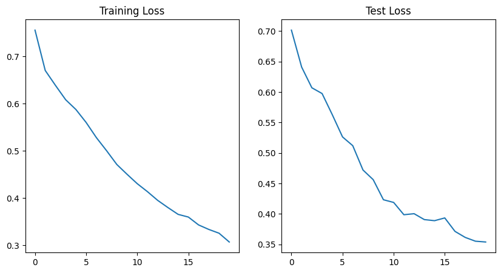
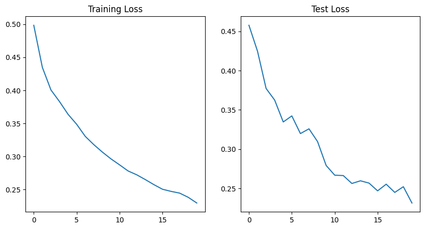
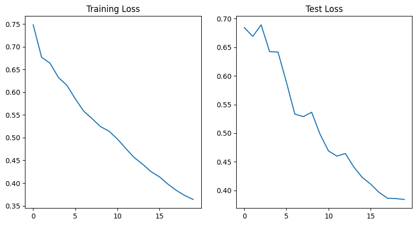
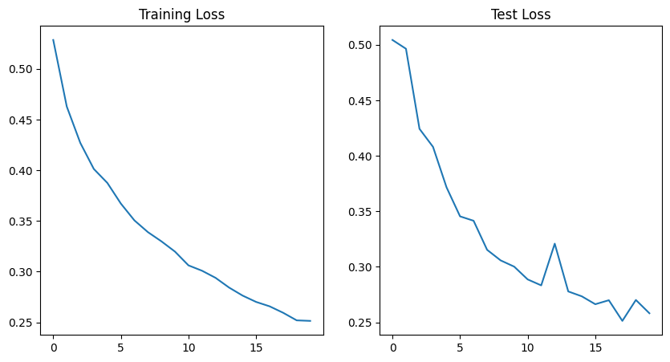
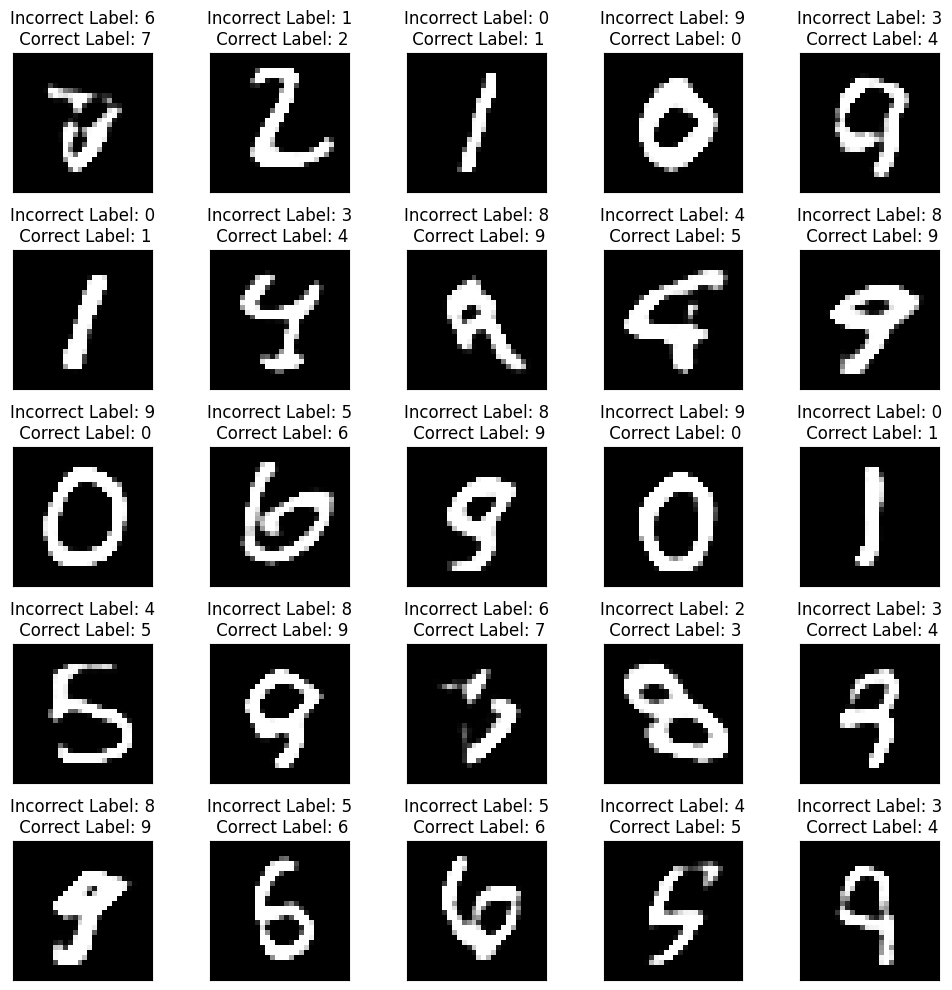
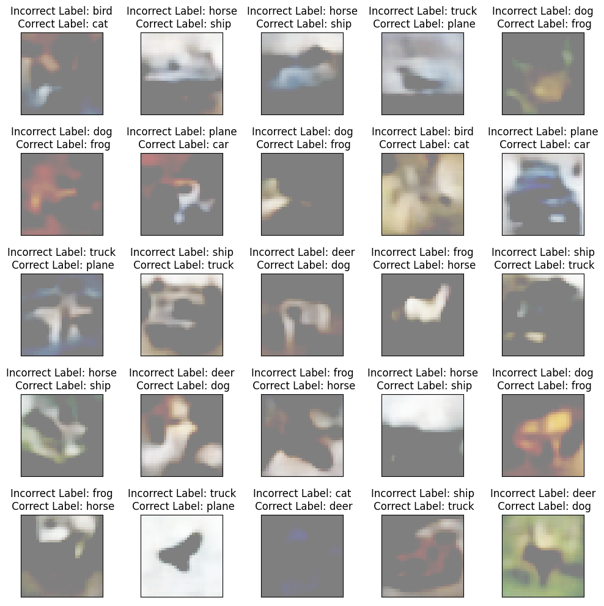

# ERA2-Session22-UNET
# UNet and Variational AutoEncoder

## Objective

1. UNet - Train with the below four variations of architecture/loss

    MP+Tr+BCE
    
    MP+Tr+Dice Loss
    
    StrConv+Tr+BCE
    
    StrConv+Ups+Dice Loss
    
2. VAE - For the following dataset customize to have an input (image and label)

    MNIST
    
    CIFAR10

## UNet
- The model was trained using 4 different methods:

| Method                                                       | Training Logs               |
| ------------------------------------------------------------ | --------------------------- |
| **Max Pooling [Encoder]  + Transpose [Decoder] + Cross Entropy Loss** |  |
| **Max Pooling [Encoder]  + Transpose [Decoder] + Dice Loss** |  |
| **Strided Convolution [Encoder] + Transpose [Decoder] + Cross Entropy Loss** |  |
| **Strided Convolution [Encoder]  + Upsampling [Decoder]  + Dice Loss** |  |
---

## Variational AutoEncoder on MNIST

- AutoEncoders are a type of network architecture with a goal to learn a compressed representation (encoding) of input data
- The encoder block of the AutoEncoder outpus encoding vector
- The decoder performs the sampling to generate the output 

- Model is trained on MNIST dataset to regenerate the input image
- Label data is added to a separate channel and passed as an input to the model
- During training, correct label data is passed to the model
- Post training, incorrect labels are passed to the model and the generated output is shown below

## Variational AutoEncoder on CIFAR10

- The process that is used for MNIST is replicated on the CIFAR10 dataset
- The output of model when incorrect label is passed to the model is shown below

