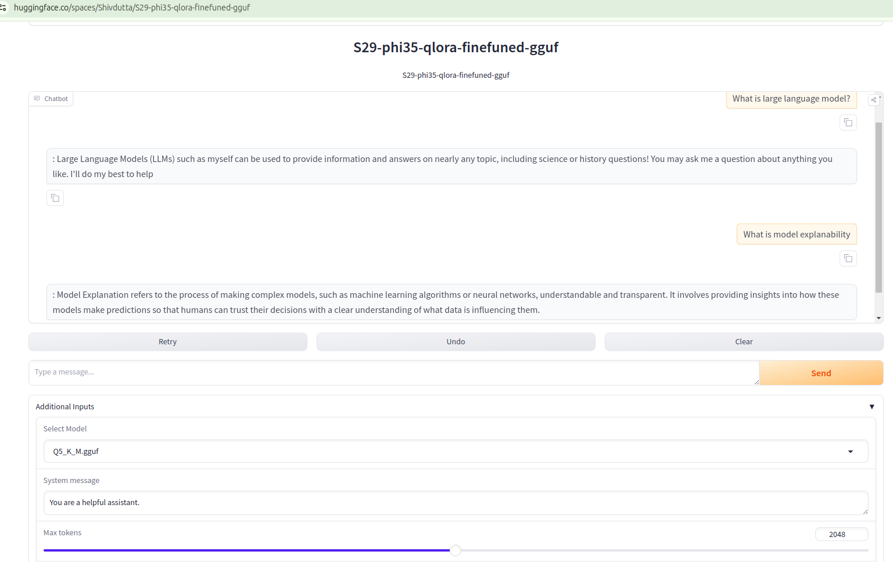

Here’s a rewritten version of your markup file to avoid plagiarism:

---

# ERA2 Session 29: LoRA, Quantization, and Fine-Tuning of Large Language Models (LLMs)

This repository provides three Jupyter notebooks, each focusing on different aspects of LLM fine-tuning, quantization, and inference.

## `S29_finetuning_llm.ipynb`

This notebook guides you through fine-tuning large language models using both LoRA (Low-Rank Adaptation) and model quantization. Key highlights include:

- **LoRA Overview**: Introduces LoRA as an efficient method to reduce trainable parameters by factorizing weight matrices, making it possible to train LLMs on limited hardware.
  
- **Quantization Techniques**: Explains the use of 8-bit quantization to reduce the memory footprint without significantly affecting the model's performance.

- **Loading Pre-trained Models**: Demonstrates loading pre-trained transformer models (e.g., from Hugging Face) as the basis for fine-tuning.

- **Preparing the Dataset**: Shows how to tokenize data and split it into training, validation, and test sets to get it ready for fine-tuning.

- **LoRA Integration**: Focuses on integrating LoRA into the fine-tuning process, inserting trainable low-rank matrices into pre-trained layers to optimize model performance.

- **Custom Training Loop**: Walks through defining a custom training loop, covering gradient accumulation, optimizer selection, learning rate schedules, and mixed-precision training for efficiency.

- **Evaluating Results**: After training, the notebook evaluates how well the model adapts to the task using LoRA and quantization.

- **Challenges and Benefits**: Discusses the balance between reduced model size and performance trade-offs.

## `S29_phi3_inference.ipynb`

- Loads a base language model (`microsoft/Phi-3.5-Mini-Instruct`) for inference.
  
- Uses LoRA fine-tuning from a previously fine-tuned model (`phi-3.5-mini-oasst1-finetunned`).

- Merges the fine-tuned model weights with the base model, removing LoRA-specific layers to optimize inference performance.

## `S29_phi3_QuantizeLLMs_checkpoint.ipynb`

- **Model Quantization**: Converts the original FP16 model into more efficient versions (e.g., Q4, Q5) using the `llama.cpp` tool, saving the models in `.gguf` format.

- **Inference Testing**: Evaluates the quantized models (Q4 and Q5) by running inference with a pre-defined prompt and controlling the output using parameters like token count, repetition, and interaction mode.

## GGUF Format

GGUF is a format for storing quantized neural network weights, commonly used to enable efficient inference on large models. It is particularly useful with tools like `llama.cpp` for running LLMs on hardware with limited resources. 

GGUF achieves efficiency by compressing model parameters with various levels of quantization (e.g., 4-bit, 8-bit integers). These compressed models can still retain the necessary structure for accurate inference.

GGUF can work with models fine-tuned using QLoRA, where quantization is applied during the fine-tuning process, reducing memory usage while maintaining model performance. After fine-tuning, models can be converted to GGUF for further inference or quantization tasks.

## Gradio Apps on Hugging Face

This section explains how to build a chatbot interface using Gradio, integrated with a language model fine-tuned through QLoRA. The chatbot leverages GGUF-format models and allows users to adjust parameters like temperature and repetition. The chatbot runs on the `LlamaCppAgent`, facilitating interactive conversations that mimic a helpful assistant.

You can explore this project on [Hugging Face Spaces](https://huggingface.co/spaces/DhrubaAdhikary1991/QLORA_Finetuned_llm).

## Session Notes

### 1. Parameter-Efficient Fine-Tuning (PEFT)

Introduced by Neil Houlsby et al. in 2019, PEFT addresses the inefficiency of fine-tuning entire models by introducing small adapter layers. These layers are trained during fine-tuning, while the rest of the model remains frozen. This approach reduces computational and storage overhead, enabling the same model to adapt to various tasks without retraining the entire model.

### 2. Low-Rank Adaptation (LoRA)

LoRA, proposed by Edward Hu and his team at Microsoft in 2021, builds on PEFT. By decomposing large parameter matrices into smaller low-rank matrices, LoRA reduces the number of parameters to be trained during fine-tuning. This approach allows efficient updates to essential model components (like attention layers), minimizing resource usage.

### 3. Quantized LoRA (QLoRA)

Introduced by Rim Dettmers in 2023, QLoRA combines LoRA with model quantization. This process quantizes a pre-trained model to a lower precision (4-bit) format and applies LoRA adapters for fine-tuning. The result is a highly efficient model that can be trained and run on GPUs with limited memory, such as consumer-grade hardware.

### 4. 4-bit Quantization

This process reduces the memory size of models by approximating weights with 16 discrete values between -1 and 1, stored in 4-bit numbers. This significantly reduces memory usage, though fine-tuning is necessary to compensate for any precision loss.

### 5. Fine-Tuning Process Overview

The notebook outlines the full process for fine-tuning models like LLaMA-2 using a combination of LoRA and 4-bit quantization, culminating in uploading the fine-tuned model to Hugging Face for public access.

---

Let me know if you need any more adjustments or additional sections to be rephrased!